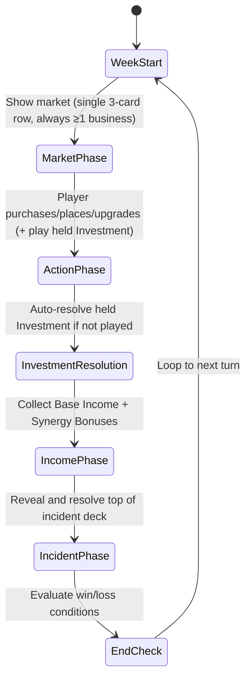
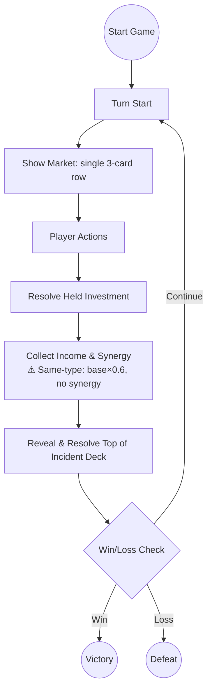

# Main Street: Core Rules and Mechanics

---

## 1. Game Overview

**Main Street** is a single‑player, turn‑based tableau card game built on the **Tableau Card Engine**. The player takes the role of a town planner revitalising a small main street by purchasing and placing business cards in a 10‑slot street grid. Each turn represents one week. Adjacent (including diagonally adjacent) businesses generate synergy bonuses, earn coins, and increase the town’s reputation. The game ends when a win or loss condition is met (default presets impose **no turn limit**; a turn limit is opt-in via an explicit `maxTurns` config — CG-0MSLXJCHH001DLIO). The design prioritises a fast‑to‑prototype core loop while delivering reusable engine components (grid, adjacency resolver, market, resource bank).

---

## 1.1 Time and Terminology

Main Street uses a single time model: **one turn = one week** of in-world time.
The annual calendar advances one week per turn (`state.week` / `state.year`),
and the HUD renders `Week W · Year Y`.

Canonical vocabulary — use these terms consistently in code, docs, tutorials,
and all user-facing text:

| Term | Meaning |
|------|---------|
| **Turn** | The atomic unit of play; the activity-log header is `Turn N`. |
| **Week** | The in-world duration of one turn. Write "this week" / "next week". |
| **WeekStart** | The phase that opens a turn and composes the action budget. |

**Do not** use "day", "today", "tomorrow", "overnight", or "same-week" as
synonyms for a turn. Non-turn uses of "day" are fine where they are proper
names (e.g. *Day Spa*, *Rainy Day*, *Volunteer Day*, *Farmers Market Day*,
*St Brigid's Day*, *May Day / Bealtaine*).

This rule is enforced by `scripts/check-terminology-guards.sh`; run it before
committing changes to player-facing text or docs.

---

## 2. Core Concepts

| Concept | Definition |
|---------|------------|
| **Slot** | A single cell in the 10‑slot **Street Grid** (rendered as a 2‑row × 5‑column layout) where a Business card may be placed. Slots are indexed 0‑9.
| **Business Card** | A card representing a shop or service. It has a cost, a base income, one or more **Synergy Types**, and optional **Upgrade Paths**.
| **Synergy Type** | A tag (e.g., *Food*, *Culture*, *Commerce*) that determines adjacency bonuses. When two adjacent businesses — orthogonally or **diagonally adjacent** (8‑way / Chebyshev adjacency, default range 1) — share a synergy type and are of **different base types** (different template IDs), each gains a **Synergy Bonus** equal to a percentage of its own effective base income per matching neighbor. The per-card synergy rate defaults to 50% (0.5) and is configurable via `synergyCoinBonus`. Same-type adjacent businesses do not receive synergy from each other.
| **Market** | The face‑up cards the player may purchase each turn. A single row of exactly **3 cards** (CG-0MSTOATDT009BRX2): 1–2 Business/Community‑Space cards, 0–1 Upgrade, 0–1 Investment event (combinations 2B+1U, 2B+1E, or 1B+1U+1E). Incidents are not purchasable; they populate a hidden face‑down **Incident Deck** instead (CG-0MSTOATDP000JNHH).
| **Resource Bank** | Holds the player's **Coins** (currency) and **Reputation** (plain score count). Coins start at 8 and Reputation starts at 3.
| **Turn** | A full week consisting of several phases (see Section 5). Turn number increments after the **week end**.
| **Event Card** | A card that triggers a one‑off effect (e.g., Festival, Tax, Storm). **Investment** events are taken from the single market row (**1 action**, no coins at take) and held until played (cost at play); **Incident** events resolve automatically from the face-down incident deck (CG-0MSTOATDP000JNHH).
| **Incident Deck** | A hidden face‑down deck of Incident cards (card back + remaining count only). Each turn the top card is revealed and resolved at the end of the turn; when the deck is exhausted, resolved events are reshuffled back in with the order rebuilt constraint‑aware (repeat‑spacing / streak limits, CG-0MSTOATDP000JNHH). A peek staff member (staff‑lookout) can look at the top card once per turn as an action.
| **Upgrade Card** | A card that modifies a specific Business card (e.g., upgrade a Bakery to a Patisserie, increasing income and synergy range).
| **Challenge** | A optional meta‑goal (e.g., *Build a Foodie Row*) that grants a bonus score at the end of the game if satisfied.

---

## 3. Card Types and Anatomy

### 3.1 Business Card

| Field | Type | Description |
|-------|------|-------------|
| **Name** | string | Human‑readable title (e.g., *Bakery*). |
| **Cost** | number (coins) | Purchase price from the market. |
| **Base Income** | number (coins per turn) | Income generated each **WeekStart** before synergy. |
| **Synergy Types** | string[] | One or more tags that interact with adjacent cards (e.g., `Food`). |
| **Upgrade Path** | string (optional) | Identifier of the Upgrade card that can transform this business. |
| **Max Level** | number (optional) | Number of upgrade steps (default 1). |
| **Reputation Per Turn** | number (optional) | Reputation contributed each turn during IncomePhase (e.g., Clinic provides +20 rep/turn). Default 0. |
| **Ongoing Cost** | number (coins per turn) | Per‑turn running cost deducted each **IncomePhase** for business cards placed on the street grid. Cards held in hand are not charged (CG-0MTC31LN3000UHDY); sold cards are not charged either (CG-0MU3VH7QW006A2XA). Defaults to 0 for cards without a CSV value. Mirrors the StaffCard/CommunitySpaceCard `ongoingCost` mechanic. |
| **Description** | string | Flavor text and any special rules. |

> **Business ongoing costs are deducted in the IncomePhase.** Business cards with `ongoingCost > 0` **placed on the street grid** have their total running cost deducted from coins each turn, alongside staff and community-space costs (CG-0MSVYPEZ90085SHE). Business cards held in the player's hand are not yet active and do **not** incur running costs (CG-0MTC31LN3000UHDY), and **sold** street cards are excluded from the deduction entirely (CG-0MU3VH7QW006A2XA) — a sold card is an inert synergy anchor, so it neither earns nor costs. The deduction is **clamped at 0 coins** — the player is never driven below zero — and both the deduction and any shortfall are logged to the activity log.

**Example Business Card (JSON‑like)**
```json
{
  "name": "Bakery",
  "cost": 3,
  "baseIncome": 2,
  "synergyTypes": ["Food"],
  "upgradePath": "Bakery→Patisserie",
  "description": "Provides warm pastries. Gains {SYNERGY_RATE} of base income per adjacent Food business."
}
```

> **Display note:** Business/community-space synergy descriptions use the `{SYNERGY_RATE}` token, resolved at render time to the **effective percentage** — the card's `synergyCoinBonus` (default 0.5) × the difficulty preset multiplier `synergyBonusPerNeighbor` (Easy 0.5 / Medium 0.35 / Hard 0.25, re-tuned by CG-0MSP26Q5N002EH8P). For example, a default-rate Bakery shows 25% on Easy, 17.5% on Medium, and 12.5% on Hard. Event-card effects ("+1 coin per X business") are genuine `coinDelta` effects and always remain absolute; reputation synergy (`synergyRepBonus`) also remains absolute by design.

### 3.2 Event Card

| Field | Type | Description |
|-------|------|-------------|
| **Name** | string | Title of the event (e.g., *Local Festival*). |
| **Trigger** | enum {`Investment`, `Incident`} | When the event resolves. **Investment** events are player‑bought (generally positive) and held until played. **Incident** events happen automatically (generally negative). |
| **Effect** | string (DSL) | Human‑readable description of the effect (e.g., `+2 coins to all Food businesses`). |
| **Target** | enum {`All`, `SpecificSynergy`, `RandomBusiness`} | Scope of the effect. |

**Example Event Card**
```json
{
  "name": "Local Festival",
  "trigger": "Investment",
  "effect": "+2 coins to all Culture businesses and +1 reputation.",
  "target": "SpecificSynergy"
}
```

### 3.3 Upgrade Card

| Field | Type | Description |
|-------|------|-------------|
| **Name** | string | Title (e.g., *Upgrade to Patisserie*). |
| **Target Business** | string | Exact name of the business this upgrade applies to. |
| **Cost** | number (coins) | Purchase price from the market. |
| **Income Bonus** | number (coins) | Additional income added to the base income after upgrade. |
| **Reputation Bonus** | number (optional) | Additional reputation contributed each turn (e.g., Medical Center provides +10 rep/turn). Default 0. |
| **Synergy Range Bonus** | number (optional) | Extends the adjacency range for synergy (e.g., from 1 slot to 2 slots). |
| **Description** | string | Flavor text. |

**Example Upgrade Card**
```json
{
  "name": "Upgrade to Patisserie",
  "targetBusiness": "Bakery",
  "cost": 4,
  "incomeBonus": 1,
  "synergyRangeBonus": 1,
  "description": "Turns a Bakery into a Patisserie, increasing income and allowing synergy with businesses two slots away."
}
```

### 3.4 Community Space Card

Community space cards (e.g. Park, Library) are a separate card family (`community-space`) placed on the street grid alongside business cards. They share the same mechanical behavior as businesses (grid placement, synergy bonuses, upgrade path, level tracking) but are classified differently for thematic clarity.

| Field | Type | Description |
|-------|------|-------------|
| **Name** | string | Human‑readable title (e.g., *Library*). |
| **Cost** | number (coins) | Purchase price from the market. |
| **Base Income** | number (coins per turn) | Income generated each **IncomePhase** before synergy. Some community spaces earn no income at all (e.g. Library `baseIncome = 0`). |
| **Ongoing Cost** | number (coins per turn) | Per‑turn running cost deducted each **IncomePhase** (e.g. Library costs 25 coins/turn to run). Defaults to 0. Mirrors the StaffCard `ongoingCost` mechanic. |
| **Reputation Per Turn** | number (optional) | Reputation contributed each turn during IncomePhase (e.g. Library provides +10 rep/turn). Default 0. |
| **Synergy Types** | string[] | One or more tags that interact with adjacent cards (e.g., `Culture`). |
| **Upgrade Path** | string (optional) | Identifier of the Upgrade card that can transform this community space. |
| **Max Level** | number (optional) | Number of upgrade steps (default 1). |
| **Description** | string | Flavor text and any special rules. |

> **Ongoing costs are deducted in the IncomePhase.** Community spaces with `ongoingCost > 0` have their total running cost deducted from coins each turn (after income is credited, alongside staff card costs). Sold community-space cards are excluded from the deduction (CG-0MU3VH7QW006A2XA). The deduction is **clamped at 0 coins** — the player is never driven below zero — and both the deduction and any shortfall are logged to the activity log.

---

## 4. Game State Model

The engine maintains a single **GameState** object with the following fields (illustrated in TypeScript for reference):

```ts
interface GameState {
  turn: number; // starts at 1
  phase: TurnPhase; // WeekStart | MarketPhase | InvestmentResolution | IncomePhase | IncidentPhase | EndCheck
  streetGrid: (BusinessCard | CommunitySpaceCard | null)[]; // length = GRID_SIZE (default 10)
  market: {
    cards: (BusinessCard | CommunitySpaceCard | UpgradeCard | EventCard)[]; // single row, exactly 3 slots
  };
  incidentDeck: EventCard[];  // Face-down incident deck; top card reveals and resolves at end of turn
  resourceBank: {
    coins: number; // start = 8
    reputation: number; // start = 3
  };
  decks: {
    business: BusinessCard[];
    communitySpace: CommunitySpaceCard[];
    event: EventCard[];    // Contains both Investment and Incident cards
    upgrade: UpgradeCard[];
  };
  hand: (BusinessCard | CommunitySpaceCard | UpgradeCard | EventCard)[]; // merged hand: any mix, up to maxHandSize
  maxHandSize: number;                 // starts at 3, growable via staff handSlotsAdded (no hard cap)
  challengesCompleted: string[]; // IDs of achieved challenges
}
```

**Key components**
- **Grid<T>** – generic NxM grid (used here as 1x10), now using the reusable `@core-engine` `Grid` type.
- **AdjacencyResolver** – computes synergy bonuses based on shared `synergyTypes` and proximity (8‑way / Chebyshev adjacency: orthogonal **and diagonal** neighbors at default range 1, extendable by upgrades) via `@core-engine/SpatialRules`.
- **Market** – a single row of 3 face‑up cards drawn from the Business, Community Space, Upgrade, and Event (Investment‑trigger) decks, always with ≥1 Business/Community‑Space card. The row is refilled at week start; taking a card to hand costs **1 action** (CG-0MSTOF1N5005PK2R businesses, CG-0MTFWBNL30043ZBM events) but no coins, and the listed cost is paid when the card is played or placed.
- **Incident Deck** – hidden face-down deck of Incident cards, order rebuilt constraint-aware at build/reshuffle (CG-0MSTOATDP000JNHH). The top card reveals and resolves each turn during IncidentPhase; when the deck runs out, resolved events are shuffled back in.
- **ActiveEffect System** – some events (e.g. `evt-flu-outbreak`) create duration-based modifiers instead of one-shot deltas. ActiveEffects are tracked in `state.activeEffects: ActiveEffect[]` and decay each turn during EndCheck. See [ActiveEffect System](#-activeeffect-system) below.
- **ResourceBank** – tracks `coins` (start 8) and `reputation` (start 3). Reputation can increase during the IncomePhase via `reputationPerTurn` from certain Health-synergy cards (e.g. Clinic provides +20 rep/turn). Reputation also counts 1:1 toward the final score (`finalScore = coins + reputation + challengeBonuses`).

### Spatial API migration note

Main Street stores the street as a 10-slot row-major array rendered as a 2x5 `Grid` and calls `neighbors()` from `@core-engine/SpatialRules` with **Chebyshev distance (8-way adjacency)** — diagonally adjacent slots count at every range (CG-0MSP1HCAS00785MP). Default range 1 checks all 8 surrounding slots; `synergyRangeBonus` upgrades expand the radius as larger 8-way squares.

**Expanded lattice — city-block grid (CG-0MT5Y1X5T001M4S6).** The 10-slot board is the `1×1` case of a general city-block grid of `5×2` street cells. Each street **owns its own ten plots** — neighbouring streets never share a plot — so street cells are tiled at a stride of exactly `(STREET_COLS, STREET_ROWS) = (5, 2)` and the world grid is the solid rectangle `worldSlotCount(cols, rows) = (STREET_COLS·cols) × (STREET_ROWS·rows)` (10 / 20 / 20 / 40 / 60 / 90 for 1×1, 2×1, 1×2, 2×2, 3×2, 3×3), with world indices ordered row-major (worldY, then worldX). **Roads** are a purely visual layer drawn in the gaps between street blocks (see below); they never consume world slots. Because the world set is a contiguous rectangle, 8-way Chebyshev adjacency over world coordinates is exactly the adjacency the player sees — including across a road, so the plot on one street's edge is adjacent to the neighbouring street's edge plot and cross-street synergy still works. `MainStreetAdjacency`, `MainStreetState` and the map renderer (`MainStreetMapView`) share this single model.

> **History:** the lattice previously shared each street's touching seam with its neighbour (a "planar seam-sharing" model, 10/18/15/27/39/52 plots, in which a four-way intersection collapsed to one shared card slot). That merged adjacent streets into a single solid block of plots, so it was replaced by the city-block grid above; the shared-seam model and its save format were removed rather than migrated.

**Map camera and zoom (CG-0MTH9OVMC001V44E).** The street is viewed through a **map-style camera**, and zoom is **always available** — it is never gated by milestones, turns, or resources. Controls: the mouse wheel over the street band, the on-screen `−` / `+` controls, the `+` / `-` keys, the arrow keys to pan, and `0` to reset the framing. Zoom level 1 is the legacy 10-slot framing; each level out scales the map by `1 / level` (maximum level 4). **Zooming out auto-grows the displayed lattice** — level *N* grows it to `(2N−1)×(2N−1)` street cells — so the neighbouring streets are actually revealed and rendered as the player zooms out (CG-0MT5Y1X5T001M4S6). The view lattice only ever grows: zooming back in keeps the revealed streets, and the camera rect (through `visibleMapSlots()`) culls whatever is off-screen, so a larger-than-needed lattice never renders extra streets. A restored camera at a higher zoom level (checkpoint/load) re-grows the lattice the same way, so a save taken while zoomed out rehydrates with its neighbouring streets visible. Only the street layer is transformed — the HUD (market, hand, log, challenges) stays fixed and the map is clipped to the street band, so revealed streets can never overdraw the HUD. `scene.setStreetViewLattice(cols, rows)` sets how many street cells the map displays manually (extra cells are view-only); `scene.setStreetPlayableLattice(cols, rows)` grows the **playable** board itself, re-indexing `state.streetGrid` by world position so placed cards, sold flags and ownership tags survive. The playable board defaults to `1×1`, so the shipping game is unchanged unless a caller expands it — zooming out reveals neighbouring streets as **view-only** cells until the playable board is expanded.

**Roads (CG-0MT5Y1X5T001M4S6).** A road band is drawn between every pair of adjacent streets, plus a band along each outer edge, so the board reads as a grid of streets in rows and columns rather than one solid block of plots. Each band is a grey rectangle (`ROAD_COLOUR`) with a dashed white centre line down its middle (`ROAD_MARKING_COLOUR`, `ROAD_DASH_PERIOD` / `ROAD_DASH_LENGTH`), with a **single thickness in both directions** (`roadBandThickness` = `ROAD_BAND_RATIO` of the smaller plot pitch, ≈57px at the canonical layout) and drawn into the camera-transformed street layer by `MainStreetRenderer.drawStreetRoads()` from `MainStreetMapView.mapRoadBands()`. The street band the map is clipped to (`streetViewportRect`) is the street's plot area **plus one road band on every side**, and the street block is shifted right by one road band in the SLL adapter so the **whole road ring is visible at the default 1× zoom** on all four edges (the village sits 20px from the left edge otherwise, less than one road). Because that band is exactly tangent to a neighbouring street's plot edge, viewport culling treats a zero-area (tangent) overlap as off-screen. Roads are decoration only: they never occupy a world slot and never affect adjacency, income or synergy. The road grid grows with the lattice as the camera zooms out.

---

## 5. Turn / Round Structure

The turn follows a deterministic state‑machine that repeats each week. The diagram below is a Mermaid **state diagram** that doubles as a flowchart for designers and developers.



**Phase details**
1. **WeekStart** – Increment `turn` counter, reset temporary flags, refill the single market row.
2. **MarketPhase** – The market shows one 3‑card row (1–2 Business/Community‑Space, 0–1 Upgrade, 0–1 Investment event). Taking a card to hand costs **1 action** (bounded additionally by hand capacity); the card's cost is paid when placed/played (cost‑at‑play).
3. **ActionPhase** – The player resolves purchases:
   - **Buy Business** → `resourceBank.coins -= cost` → place card into a chosen empty slot.
   - **Buy Upgrade** → `resourceBank.coins -= cost` → apply upgrade effects to the targeted Business.
   - **Take Event (Investment)** → add the event card to the player's hand for **1 action** (bounded by `maxHandSize`). The player may play it during MarketPhase via a `play-event` action, paying its cost then.
   - **Play Event (from hand)** → resolve an Investment event card from the hand immediately and remove it.
4. **InvestmentResolution** – Reserved phase; Investment events are **not** auto‑resolved here. Unplayed events persist in the hand until the player plays them during a later MarketPhase.
5. **IncomePhase** – For each placed Business, compute:
   - `totalIncome = effectiveBase + synergyBonus`, where `effectiveBase = (baseIncome + incomeBonus) × sameTypePenalty` and `synergyBonus = effectiveBase × synergyCoinBonus × synergyBonusPerNeighbor × N`. Synergy uses a percentage-based formula: each matching neighbor (8‑way adjacent, including diagonal) contributes a percentage of the source business's effective base income, scaled by the difficulty preset multiplier. Synergy is only earned from adjacent neighbors of **different base types** (template IDs). Same-type adjacent businesses: synergy is nullified (0 contribution), and base income (including any income bonus from upgrades) is reduced to **60%**.
   - `resourceBank.coins += totalIncome`.
   - `totalReputationPerTurn` is calculated from all placed cards (some Health-synergy cards like the Clinic provide `reputationPerTurn`). Upgrades may also contribute `reputationBonus`. Synergy reputation from adjacent neighbors is only earned from **different-type** businesses; same-type neighbors contribute 0 reputation synergy.
   - `resourceBank.reputation += totalReputationPerTurn`.
   - **Ongoing costs** (staff cards, community-space cards, and business cards **placed on the street grid** with `ongoingCost > 0` — e.g. the Library's 25 coins/turn; business cards held in hand are not charged, CG-0MTC31LN3000UHDY) are deducted from coins after income. Deductions are clamped at 0 coins (the player is never driven below zero) and logged.
6. **IncidentPhase** – Reveal and resolve the top card of the face‑down incident deck. The player knows only how many incidents remain (card back + count); the revealed card's effect posts to the activity log. When the deck is exhausted, resolved events are reshuffled back in with the order rebuilt constraint‑aware (CG-0MSTOATDP000JNHH).
7. **EndCheck** – Evaluate win/loss conditions.
8. Loop back to **WeekStart** for the next turn.

The turn ends when either:
- The player meets a **Win Condition** (Section 7), **or**
- A **Loss Condition** (Section 8) triggers.

Default presets impose **no turn limit** (CG-0MSLXJCHH001DLIO): a player who keeps coins >= 0 and reputation > 0 can pass turns indefinitely without winning — passive play simply never reaches the score threshold. Configs that explicitly set `maxTurns` additionally end the turn when `turn >= maxTurns` (via the turn-limit victory/exhaustion paths below).

---

## 6. Core Actions

### 6.0 Action Economy (weekly action budget)

Each week (MarketPhase) the player has **exactly one action** — two while a **General Manager** is employed (CG-0MSTOF1N5005PK2R) — plus any **banked** actions carried over from previous weeks (CG-0MT3IOPZB005LNAR). The budget resets at **WeekStart**; spending it blocks further action-type operations until the next week. The remaining budget is shown in the HUD action counter (banked count shown as `(N banked)` when non-zero).

**Week-start composition.** At WeekStart the weekly budget is:

```
1 base + staff actionsPerTurn bonus + banked actions (capped at 2)
```

- The **base action banks**: any unused base action at end of week is banked, up to a **bank cap of 2**.
- **Staff actions never bank.** Staff-derived actions (e.g. the General Manager's +1 `actionsPerTurn`) are **consumed first** and are not bankable — an idle GM week banks exactly 1 (the base), not 2.
- Spending during the week draws down the combined budget (base + staff + banked share one counter).
- **Banked is consumed 1-per-action.** Every action-type operation decrements the banked reserve by 1 (floor 0) alongside the weekly counter (CG-0MTCP7F9S009HARC) — banked actions are spent as the player acts, so a banked week grants only its carried-over actions, never an endless reserve. Premium same-week placements (which replace the action with a +50% coin charge) do **not** consume the bank.
- **No expiry:** banked actions persist indefinitely across weeks until spent. They reset to 0 only on a new game.
- At week end, at most **1** action can bank (only the base portion), so reaching the cap takes two idle weeks; overflow beyond the cap is discarded.

> **Follow-ups:** Tutorial coverage of banking is tracked in CG-0MT3JK16W006A66P; a banking-aware AI strategy (deliberate hoarding) in CG-0MT3JMGA60091J8W.

**Action-type operations (spend the weekly action):**

| Operation | Cost | Notes |
|-----------|------|-------|
| Move a market card to hand | 1 action | Free of coins; pays the listed cost when placed. |
| Take an Investment event to hand | 1 action | Free of coins; pays the event's listed cost when played. An event moved and played on the **same week** is the 1-action total composite below. |
| Play a held Investment event | 1 action | Pays the event's listed cost at play. A **same-week** play of the event just moved to hand that week is a **free composite** (the move already spent the action); an event held from a previous week costs **1 action**. |
| Play a card from hand to the street | 1 action | Pays the card's listed cost at placement. |
| Direct buy-and-place (market→street) | 1 action | Skips the hand; pays **+50%** over the listed cost (`Math.ceil(cost * 1.5 * 2) / 2`) when the move leaves **no action** for the placement (same pricing as the click composite). Triggered by dragging a market card straight onto a street slot. On a Golden Mile 2-action week the placement instead consumes the remaining action at **listed cost** — drag is never cheaper than click. Upgrade cards use the same gesture, dropping onto the business they target (CG-0MT3IYSRL001VVUP). |
| Hire a staff card | 1 action | From the general market row. |
| Close a business/community-space card | 1 action | **No refund.** Removes the card from the street entirely (slot → `null`, card → discard pile) so the slot can be re-filled in a later week. Only non-sold cards can be closed. Selling the *same* card is free but leaves an inert sold card occupying the slot (see below). |

**Free operations (never consume an action):**

- Market re-roll/refresh
- Selling a business — **free**, and the card **stays on the grid** as an inert *sold* marker (no income/reputation for itself, **no ongoing/running cost** — sold cards are excluded from the IncomePhase ongoing-cost deduction (CG-0MU3VH7QW006A2XA) — but still a synergy anchor for its neighbours; the slot stays occupied). Refund formula (CG-0MT5XO7DI0066QCT): `Math.ceil((card.cost + totalUpgradeCost) * 1.5) + Math.max(0, currentIncome − effectiveBase) + Math.max(0, currentReputationPerTurn − (repPerTurn + reputationBonus))` where `effectiveBase = (baseIncome + incomeBonus) × (hasAdjacentSameType ? 0.6 : 1)` and the 1.5× is the same +50% buy-and-place premium; applies to business **and** community-space cards; synergy comps are 0 when undefined and never negative.
  The sell dialog and activity log show the breakdown (base, synergy income, synergy rep).
- Hint (still 1/week)
- Ending the turn

> Discarding from hand (CG-0MTQ7KUVF009ELQK): **action-free, but not free of reputation.** Select a hand card and click **[Discard]** (in the End Turn slot) to discard it to its family discard pile. The discard deducts the card's listed coin `cost` from reputation, **clamped at 0** (reputation never goes negative). It applies to every family — business, community-space, upgrade and event — and a 0-cost card costs nothing. The discard is **not** gated on affordability: a player with less reputation than the card's cost may still discard, down to 0. There is no confirmation dialog. The discard is undoable (hand, discard pile and reputation are all restored).

> Upgrade and event actions (CG-0MT3IYSRL001VVUP, CG-0MTFWBNL30043ZBM): taking an **upgrade** or **Investment event** from the market into hand, and playing either from hand, each consume **1 action** — they are action-type operations, not free operations. They are listed in the action-economy table above.

> Cancelling a pending selection (CG-0MT3IYSRL001VVUP): after selecting a hand card the next street click places (business) or applies (upgrade) it. Pressing **Escape** cancels that targeting and returns to the market phase; the card stays in hand and the weekly action already spent on the move is unaffected, so re-selecting and playing it later the same week still costs no second action. Escape only toggles the Settings panel when no targeting is in progress.

> Sell price (CG-0MT5XO7DI0066QCT): the sell refund mirrors the buy-and-place premium (1.5× purchase + upgrades) and adds the card's current synergy value, so emergency cash reflects what the card actually earns on the grid. A card with no synergies still recovers more than before (`/2 → ×1.5`); a well-synergised card recovers coins **plus** rep-derived value automatically. The breakdown is visible before the player confirms.

> Close vs Sell (CG-0MT5XT7K3005IBBV): clicking a non-sold street card opens a **Manage Card** dialog with **[Sell] [Close] [Cancel]**. **Sell** is free and keeps the sold card on the grid as an inert synergy anchor (the slot remains occupied permanently). **Close** costs **1 action and no coins**, removes the card to the discard pile, recalculates its neighbours **without** the removed card's synergy, and frees the slot for a future placement. Sold cards cannot be closed — once sold, the only way past that slot is a future "clear sold card" capability (not yet implemented).

> Same-week composite pricing (CG-0MT24X0SX007RLHN): clicking a market card (move-to-hand, 1 action) and then placing it on an empty slot the same turn is a **single purchase**. If the move consumed the weekly action (0 actions left), the placement charges the **+50% premium** (`Math.ceil(cost * 1.5 * 2) / 2`) and consumes **no additional action**; an explainer dialog fires first (Proceed commits, Cancel aborts with no cost, "Don't show this again" persists the preference). If an action **remains** (Golden Mile 2-action weeks), the placement consumes it at **listed cost**. A card left in hand and placed in a **later** week costs that week's action at listed cost, with no dialog. Business and community-space cards are priced identically.

---

| Action | Description | Preconditions | Result |
|--------|-------------|---------------|--------|
| **Buy Business** | Spend coins to acquire a Business card from the market and place it on an empty slot. | Market contains Business card; `resourceBank.coins >= cost`; at least one empty slot. | Business placed; coins deducted; slot becomes occupied. |
| **Buy Upgrade** | Move an Upgrade card from the market to the hand (the upgrade is then **applied from hand** by clicking the card and then the target business). | Market contains Upgrade card targeting a placed Business at the required level; hand has room. | Upgrade appended to hand; the weekly action is spent on the move (the same-week application is then a free composite; an upgrade held from a previous week costs 1 action when applied). |
| **Buy Event** | Take an Investment event card from the market into the hand for **1 action** (no coins at take; cost is paid when the event is executed from hand). | Market contains Investment event card; hand has room (`hand.length < maxHandSize`); at least 1 action remaining. | Event appended to hand; the weekly action is spent; **no coins deducted** at take time. Player pays the event's listed cost when it is played during MarketPhase. There is **no limit on the number of event cards** in hand — only hand capacity (`maxHandSize`) applies. |
| **Play Event (from hand)** | Play an Investment event card from the hand during MarketPhase. | Player holds an Investment event card in hand; current phase is MarketPhase. | Event resolved and removed from hand. |
| **Place Business** | Choose an empty slot and put the purchased Business card there. | Business card in hand; slot is empty. | Card is now part of `streetGrid`. |
| **Resolve Event** | Apply the effect described on an Event card. | Event card active. | Game state mutated per effect (coins, reputation, temporary modifiers). |
| **End Turn** | Transition to the next phase/state. | All desired actions for the week are complete. | Turn counter increments, flow moves to week end or next WeekStart. |

---

## 7. Win Conditions

The game is considered **won** when **any** of the following conditions are satisfied **at the end of a week end**:

1. **Score Threshold** – `finalScore >= winThreshold` where winThreshold is difficulty-scaled (100 Easy / 120 Medium / 150 Hard):
   ```ts
   finalScore = resourceBank.coins + resourceBank.reputation + challengeBonus;
   // challengeBonus = sum of 10 points per completed Challenge.
   ```
2. **Challenge Completion** – All **Primary Challenges** (defined in `docs/games/the-build/challenges.md`) are completed, granting an automatic win regardless of numeric score.
3. **Turn Limit Victory** *(opt-in)* – Only when a config explicitly sets `maxTurns` (e.g. `maxTurns: 20`): the player reaches `turn >= maxTurns` with a **positive reputation** (`reputation > 0`) and **coins >= 0**; the final score is then evaluated against the threshold. If the threshold is not met, the game ends as a loss.

All win conditions are **deterministic** given the same seed, ensuring testability.

> **Challenge evaluation timing (CG-0MU37CKRR008252I).** Challenges are
> evaluated after **every** action — business placement, purchase, upgrade,
> event play, staff hire, favour exchange, and so on — not only at the end of
> the turn. A satisfied challenge is marked complete immediately (tracker,
> activity log, score bonus, and celebration VFX/SFX), and a completed
> challenge is never re-completed. The end-of-turn **EndCheck** still evaluates
> challenges as a **safety net**, so completions caused by the closing phases
> (Income / Incident) are caught before win/loss is determined. Undoing the
> action that completed a challenge prompts a warning and, if confirmed,
> revokes the completion (tracker, log, and score bonus all revert together).

---

## 8. Loss Conditions

The game ends in **loss** if **any** of the following occur **immediately after a phase**:

- **Bankruptcy** – `resourceBank.coins < 0`.
- **Reputation Collapse** – `resourceBank.reputation <= 0` (the town is considered abandoned).
- **Turn Exhaustion Without Victory** *(opt-in)* – Only when a config explicitly sets `maxTurns`: `turn >= maxTurns` is reached and none of the win conditions in Section 7 are met.

Loss conditions are evaluated at the end of the **Night Income** phase before checking win conditions, guaranteeing a clear order of evaluation.

---

## 9. Randomness and Information

| Aspect | Random Source | Visibility |
|--------|----------------|------------|
| **Market Draw** | Seeded RNG draws from the Business, Community Space, Upgrade, and Event decks to fill a single 3‑card market row (always ≥1 Business/Community‑Space card; 0–1 Upgrade; 0–1 Investment event). | Face‑up – player sees all options before taking.
| **Event Cards** | Incident events populate a hidden face-down incident deck (card back + remaining count only, CG-0MSTOATDP000JNHH); the top card is revealed and resolved at the end of each turn. Investment events appear in the single market row and are taken to hand (**1 action**) and held until played (cost paid at play). | Incidents: face-down deck (count only). Investments: face-up in market, then held.
| **Challenge Generation** | Fixed set defined in `challenges.md`; no randomness.
| **RNG Seed** | Determined by the **Game Engine** on startup (`Math.seedrandom(seedString)`). | The seed is displayed on the title screen for reproducibility.

All randomness is **deterministic** when the same seed is used, enabling automated testing of the core loop.

---

## Activity Log (Effective Deltas and Per-Turn Net)

Every resource-mutating action appends an entry to the activity log showing its **effective (post-mitigation) coin and reputation deltas** (CG-0MT5W7UJJ0065MEZ):

- Enriched entries append a compact delta description built by `describeEventEffects` — e.g. `(+3 coins, +2 rep)`, `(-1 coins)`, `(+1 rep)`, or `(no effect)` — computed from the resources actually changed (after discounts, clamps, multipliers, and event resolution).
- Entry colour classification (`gain` / `loss` / `neutral`) is derived by `classifyEffect` from the same effective net (coins + rep), so a mixed exchange colours consistently with its net effect.
- Examples: purchases, upgrades, sells, staff hire/layoff, ongoing-cost deductions (including the clamped `Insufficient coins for ...` shortfall), market refreshes, Community Favour exchanges, events played from hand (cost *plus* resolved effects), investments, and incident resolutions.

Each completed turn ends with a **per-turn net summary row** — `Turn <n> net: <effective deltas>` — comparing the resource bank against a **week-start snapshot** taken at the beginning of `executeWeekStart`. The snapshot is persisted with saves (legacy saves fall back to the current resources), and the net row is emitted even when the game ends prematurely — in that case it is written **before** the `Game Over` / `Bankruptcy` banner so the summary precedes the loss entry. When both are present, the net row always precedes the game-over entry; on a normal turn it is the final log entry.

---

## Flowchart Summary

Below is a high‑level flowchart that captures the complete game loop, useful for documentation and onboarding of new developers.



---

## 9. ActiveEffect System (Duration-Based Modifiers)

Certain events (e.g., `evt-flu-outbreak`) create **ActiveEffect** instances that modify game parameters over multiple turns instead of applying one-shot coin/reputation deltas.

### ActiveEffect Data Structure

Each ActiveEffect tracks:
- **`effectType`** – discriminator (e.g. `income-multiplier`)
- **`multiplier`** – scalar applied (e.g. `0.8` for 80% income)
- **`turnsRemaining`** – number of turns before the effect expires
- **`sourceEventId`** – the card/event ID that created the effect
- **`description`** – human-readable summary for logging/UI

### Storage

ActiveEffects are stored in `state.activeEffects: ActiveEffect[]` (part of `MainStreetState`). The array is serialized/deserialized for save/load; missing field in old saves defaults to `[]`.

### Turn Flow

1. **IncomePhase** – `applyIncome()` checks `state.activeEffects` for `income-multiplier` effects and applies the multiplier per-slot *before* the reputation multiplier.
2. **EndCheck** – `decayActiveEffects()` decrements `turnsRemaining` on all active effects. Effects that reach 0 are removed and logged.

### Example: Flu Outbreak (`evt-flu-outbreak`)

- **Trigger**: Incident (automatic reveal from the face-down incident deck)
- **Base duration**: 5 turns
- **Effect**: All businesses generate 80% income (0.8× multiplier)
- **Duration reduction**: If a Clinic (`biz-clinic`) is on the street grid, duration → 3 turns. If a Medical Center (`upg-medical-center`) is present, duration → 2 turns. Only the stronger reduction applies.
- **Minimum duration**: 1 turn (floor)
- **Income application**: The 0.8× multiplier is applied to each slot's base + synergy income *before* the reputation coin multiplier.

### Extensibility

The ActiveEffect system is designed for future duration-based events. New effect types can be added by using a new `effectType` string and implementing the corresponding modifier in the relevant game computation function.

---

**Document status**: AWAITING PRODUCER REVIEW.

*Prepared by*: `opencode` – implementation of work item **CG-0MM4RC1K81JU4U5D**.
