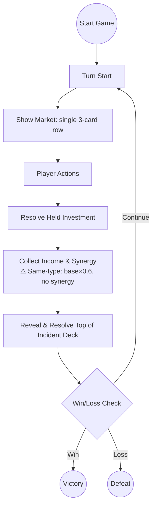

# Main Street: Core Rules and Mechanics

---

## 1. Game Overview

**Main Street** is a single‑player, turn‑based tableau card game built on the **Tableau Card Engine**. The player takes the role of a town planner revitalising a small main street by purchasing and placing business cards in a 10‑slot street grid. Each turn represents a day (or night) cycle. Adjacent (including diagonally adjacent) businesses generate synergy bonuses, earn coins, and increase the town’s reputation. The game ends when a win or loss condition is met (default presets impose **no turn limit**; a turn limit is opt-in via an explicit `maxTurns` config — CG-0MSLXJCHH001DLIO). The design prioritises a fast‑to‑prototype core loop while delivering reusable engine components (grid, adjacency resolver, market, resource bank).

---

## 2. Core Concepts

| Concept | Definition |
|---------|------------|
| **Slot** | A single cell in the 10‑slot **Street Grid** (rendered as a 2‑row × 5‑column layout) where a Business card may be placed. Slots are indexed 0‑9.
| **Business Card** | A card representing a shop or service. It has a cost, a base income, one or more **Synergy Types**, and optional **Upgrade Paths**.
| **Synergy Type** | A tag (e.g., *Food*, *Culture*, *Commerce*) that determines adjacency bonuses. When two adjacent businesses — orthogonally or **diagonally adjacent** (8‑way / Chebyshev adjacency, default range 1) — share a synergy type and are of **different base types** (different template IDs), each gains a **Synergy Bonus** equal to a percentage of its own effective base income per matching neighbor. The per-card synergy rate defaults to 50% (0.5) and is configurable via `synergyCoinBonus`. Same-type adjacent businesses do not receive synergy from each other.
| **Market** | The face‑up cards the player may purchase each turn. A single row of exactly **3 cards** (CG-0MSTOATDT009BRX2): 1–2 Business/Community‑Space cards, 0–1 Upgrade, 0–1 Investment event (combinations 2B+1U, 2B+1E, or 1B+1U+1E). Incidents are not purchasable; they populate a hidden face‑down **Incident Deck** instead (CG-0MSTOATDP000JNHH).
| **Resource Bank** | Holds the player's **Coins** (currency) and **Reputation** (plain score count). Coins start at 8 and Reputation starts at 3.
| **Turn** | A full day/night cycle consisting of several phases (see Section 5). Turn number increments after the **Night Phase**.
| **Event Card** | A card that triggers a one‑off effect (e.g., Festival, Tax, Storm). **Investment** events are taken from the single market row (free) and held until played (cost at play); **Incident** events resolve automatically from the face-down incident deck (CG-0MSTOATDP000JNHH).
| **Incident Deck** | A hidden face‑down deck of Incident cards (card back + remaining count only). Each turn the top card is revealed and resolved at the end of the turn; when the deck is exhausted, resolved events are reshuffled back in with the order rebuilt constraint‑aware (repeat‑spacing / streak limits, CG-0MSTOATDP000JNHH). A peek staff member (staff‑lookout) can look at the top card once per turn as an action.
| **Upgrade Card** | A card that modifies a specific Business card (e.g., upgrade a Bakery to a Patisserie, increasing income and synergy range).
| **Challenge** | A optional meta‑goal (e.g., *Build a Foodie Row*) that grants a bonus score at the end of the game if satisfied.

---

## 3. Card Types and Anatomy

### 3.1 Business Card

| Field | Type | Description |
|-------|------|-------------|
| **Name** | string | Human‑readable title (e.g., *Bakery*). |
| **Cost** | number (coins) | Purchase price from the market. |
| **Base Income** | number (coins per turn) | Income generated each **Day Phase** before synergy. |
| **Synergy Types** | string[] | One or more tags that interact with adjacent cards (e.g., `Food`). |
| **Upgrade Path** | string (optional) | Identifier of the Upgrade card that can transform this business. |
| **Max Level** | number (optional) | Number of upgrade steps (default 1). |
| **Reputation Per Turn** | number (optional) | Reputation contributed each turn during IncomePhase (e.g., Clinic provides +0.2 rep/turn). Default 0. |
| **Description** | string | Flavor text and any special rules. |

**Example Business Card (JSON‑like)**
```json
{
  "name": "Bakery",
  "cost": 3,
  "baseIncome": 2,
  "synergyTypes": ["Food"],
  "upgradePath": "Bakery→Patisserie",
  "description": "Provides warm pastries. Gains {SYNERGY_RATE} of base income per adjacent Food business."
}
```

> **Display note:** Business/community-space synergy descriptions use the `{SYNERGY_RATE}` token, resolved at render time to the **effective percentage** — the card's `synergyCoinBonus` (default 0.5) × the difficulty preset multiplier `synergyBonusPerNeighbor` (Easy 0.5 / Medium 0.35 / Hard 0.25, re-tuned by CG-0MSP26Q5N002EH8P). For example, a default-rate Bakery shows 25% on Easy, 17.5% on Medium, and 12.5% on Hard. Event-card effects ("+1 coin per X business") are genuine `coinDelta` effects and always remain absolute; reputation synergy (`synergyRepBonus`) also remains absolute by design.

### 3.2 Event Card

| Field | Type | Description |
|-------|------|-------------|
| **Name** | string | Title of the event (e.g., *Local Festival*). |
| **Trigger** | enum {`Investment`, `Incident`} | When the event resolves. **Investment** events are player‑bought (generally positive) and held until played. **Incident** events happen automatically (generally negative). |
| **Effect** | string (DSL) | Human‑readable description of the effect (e.g., `+2 coins to all Food businesses`). |
| **Target** | enum {`All`, `SpecificSynergy`, `RandomBusiness`} | Scope of the effect. |

**Example Event Card**
```json
{
  "name": "Local Festival",
  "trigger": "Investment",
  "effect": "+2 coins to all Culture businesses and +1 reputation.",
  "target": "SpecificSynergy"
}
```

### 3.3 Upgrade Card

| Field | Type | Description |
|-------|------|-------------|
| **Name** | string | Title (e.g., *Upgrade to Patisserie*). |
| **Target Business** | string | Exact name of the business this upgrade applies to. |
| **Cost** | number (coins) | Purchase price from the market. |
| **Income Bonus** | number (coins) | Additional income added to the base income after upgrade. |
| **Reputation Bonus** | number (optional) | Additional reputation contributed each turn (e.g., Medical Center provides +0.1 rep/turn). Default 0. |
| **Synergy Range Bonus** | number (optional) | Extends the adjacency range for synergy (e.g., from 1 slot to 2 slots). |
| **Description** | string | Flavor text. |

**Example Upgrade Card**
```json
{
  "name": "Upgrade to Patisserie",
  "targetBusiness": "Bakery",
  "cost": 4,
  "incomeBonus": 1,
  "synergyRangeBonus": 1,
  "description": "Turns a Bakery into a Patisserie, increasing income and allowing synergy with businesses two slots away."
}
```

### 3.4 Community Space Card

Community space cards (e.g. Park, Library) are a separate card family (`community-space`) placed on the street grid alongside business cards. They share the same mechanical behavior as businesses (grid placement, synergy bonuses, upgrade path, level tracking) but are classified differently for thematic clarity.

| Field | Type | Description |
|-------|------|-------------|
| **Name** | string | Human‑readable title (e.g., *Library*). |
| **Cost** | number (coins) | Purchase price from the market. |
| **Base Income** | number (coins per turn) | Income generated each **IncomePhase** before synergy. Some community spaces earn no income at all (e.g. Library `baseIncome = 0`). |
| **Ongoing Cost** | number (coins per turn) | Per‑turn running cost deducted each **IncomePhase** (e.g. Library costs 0.25 coins/turn to run). Defaults to 0. Mirrors the StaffCard `ongoingCost` mechanic. |
| **Reputation Per Turn** | number (optional) | Reputation contributed each turn during IncomePhase (e.g. Library provides +0.1 rep/turn). Default 0. |
| **Synergy Types** | string[] | One or more tags that interact with adjacent cards (e.g., `Culture`). |
| **Upgrade Path** | string (optional) | Identifier of the Upgrade card that can transform this community space. |
| **Max Level** | number (optional) | Number of upgrade steps (default 1). |
| **Description** | string | Flavor text and any special rules. |

> **Ongoing costs are deducted in the IncomePhase.** Community spaces with `ongoingCost > 0` have their total running cost deducted from coins each turn (after income is credited, alongside staff card costs). The deduction is **clamped at 0 coins** — the player is never driven below zero — and both the deduction and any shortfall are logged to the activity log.

---

## 4. Game State Model

The engine maintains a single **GameState** object with the following fields (illustrated in TypeScript for reference):

```ts
interface GameState {
  turn: number; // starts at 1
  phase: DayPhase; // DayStart | MarketPhase | InvestmentResolution | IncomePhase | IncidentPhase | EndCheck
  streetGrid: (BusinessCard | CommunitySpaceCard | null)[]; // length = GRID_SIZE (default 10)
  market: {
    cards: (BusinessCard | CommunitySpaceCard | UpgradeCard | EventCard)[]; // single row, exactly 3 slots
  };
  incidentDeck: EventCard[];  // Face-down incident deck; top card reveals and resolves at end of turn
  resourceBank: {
    coins: number; // start = 8
    reputation: number; // start = 3
  };
  decks: {
    business: BusinessCard[];
    communitySpace: CommunitySpaceCard[];
    event: EventCard[];    // Contains both Investment and Incident cards
    upgrade: UpgradeCard[];
  };
  hand: (BusinessCard | CommunitySpaceCard | UpgradeCard | EventCard)[]; // merged hand: any mix, up to maxHandSize
  maxHandSize: number;                 // starts at 3, growable via staff handSlotsAdded (no hard cap)
  challengesCompleted: string[]; // IDs of achieved challenges
}
```

**Key components**
- **Grid<T>** – generic NxM grid (used here as 1x10), now using the reusable `@core-engine` `Grid` type.
- **AdjacencyResolver** – computes synergy bonuses based on shared `synergyTypes` and proximity (8‑way / Chebyshev adjacency: orthogonal **and diagonal** neighbors at default range 1, extendable by upgrades) via `@core-engine/SpatialRules`.
- **Market** – a single row of 3 face‑up cards drawn from the Business, Community Space, Upgrade, and Event (Investment‑trigger) decks, always with ≥1 Business/Community‑Space card. The row is refilled at day start; taking a card to hand is **free** (CG-0MSTOATDT009BRX2), and the listed cost is paid when the card is played or placed.
- **Incident Deck** – hidden face-down deck of Incident cards, order rebuilt constraint-aware at build/reshuffle (CG-0MSTOATDP000JNHH). The top card reveals and resolves each turn during IncidentPhase; when the deck runs out, resolved events are shuffled back in.
- **ActiveEffect System** – some events (e.g. `evt-flu-outbreak`) create duration-based modifiers instead of one-shot deltas. ActiveEffects are tracked in `state.activeEffects: ActiveEffect[]` and decay each turn during EndCheck. See [ActiveEffect System](#-activeeffect-system) below.
- **ResourceBank** – tracks `coins` (start 8) and `reputation` (start 3). Reputation can increase during the IncomePhase via `reputationPerTurn` from certain Health-synergy cards (e.g. Clinic provides +0.2 rep/turn). Reputation also counts 1:1 toward the final score (`finalScore = coins + reputation + challengeBonuses`).

### Spatial API migration note

Main Street stores the street as a 10-slot row-major array rendered as a 2x5 `Grid` and calls `neighbors()` from `@core-engine/SpatialRules` with **Chebyshev distance (8-way adjacency)** — diagonally adjacent slots count at every range (CG-0MSP1HCAS00785MP). Default range 1 checks all 8 surrounding slots; `synergyRangeBonus` upgrades expand the radius as larger 8-way squares.

---

## 5. Turn / Round Structure

The turn follows a deterministic state‑machine that repeats each day/night cycle. The diagram below is a Mermaid **state diagram** that doubles as a flowchart for designers and developers.


**Phase details**
1. **DayStart** – Increment `turn` counter, reset temporary flags, refill the single market row.
2. **MarketPhase** – The market shows one 3‑card row (1–2 Business/Community‑Space, 0–1 Upgrade, 0–1 Investment event). Taking a card to hand is **free** (bounded only by hand capacity); the card's cost is paid when placed/played (cost‑at‑play).
3. **ActionPhase** – The player resolves purchases:
   - **Buy Business** → `resourceBank.coins -= cost` → place card into a chosen empty slot.
   - **Buy Upgrade** → `resourceBank.coins -= cost` → apply upgrade effects to the targeted Business.
   - **Take Event (Investment)** → add the event card to the player's hand for free (bounded by `maxHandSize`). The player may play it during MarketPhase via a `play-event` action, paying its cost then.
   - **Play Event (from hand)** → resolve an Investment event card from the hand immediately and remove it.
4. **InvestmentResolution** – Reserved phase; Investment events are **not** auto‑resolved here. Unplayed events persist in the hand until the player plays them during a later MarketPhase.
5. **IncomePhase** – For each placed Business, compute:
   - `totalIncome = effectiveBase + synergyBonus`, where `effectiveBase = (baseIncome + incomeBonus) × sameTypePenalty` and `synergyBonus = effectiveBase × synergyCoinBonus × synergyBonusPerNeighbor × N`. Synergy uses a percentage-based formula: each matching neighbor (8‑way adjacent, including diagonal) contributes a percentage of the source business's effective base income, scaled by the difficulty preset multiplier. Synergy is only earned from adjacent neighbors of **different base types** (template IDs). Same-type adjacent businesses: synergy is nullified (0 contribution), and base income (including any income bonus from upgrades) is reduced to **60%**.
   - `resourceBank.coins += totalIncome`.
   - `totalReputationPerTurn` is calculated from all placed cards (some Health-synergy cards like the Clinic provide `reputationPerTurn`). Upgrades may also contribute `reputationBonus`. Synergy reputation from adjacent neighbors is only earned from **different-type** businesses; same-type neighbors contribute 0 reputation synergy.
   - `resourceBank.reputation += totalReputationPerTurn`.
   - **Ongoing costs** (staff cards and community-space cards with `ongoingCost > 0`, e.g. the Library's 0.25 coins/turn) are deducted from coins after income. Deductions are clamped at 0 coins (the player is never driven below zero) and logged.
6. **IncidentPhase** – Reveal and resolve the top card of the face‑down incident deck. The player knows only how many incidents remain (card back + count); the revealed card's effect posts to the activity log. When the deck is exhausted, resolved events are reshuffled back in with the order rebuilt constraint‑aware (CG-0MSTOATDP000JNHH).
7. **EndCheck** – Evaluate win/loss conditions.
8. Loop back to **DayStart** for the next turn.

The turn ends when either:
- The player meets a **Win Condition** (Section 7), **or**
- A **Loss Condition** (Section 8) triggers.

Default presets impose **no turn limit** (CG-0MSLXJCHH001DLIO): a player who keeps coins >= 0 and reputation > 0 can pass turns indefinitely without winning — passive play simply never reaches the score threshold. Configs that explicitly set `maxTurns` additionally end the turn when `turn >= maxTurns` (via the turn-limit victory/exhaustion paths below).

---

## 6. Core Actions

### 6.0 Action Economy (daily action budget)

Each day (MarketPhase) the player has **exactly one action** — two while a **General Manager** is employed (CG-0MSTOF1N5005PK2R) — plus any **banked** actions carried over from previous days (CG-0MT3IOPZB005LNAR). The budget resets at **DayStart**; spending it blocks further action-type operations until the next day. The remaining budget is shown in the HUD action counter (banked count shown as `(N banked)` when non-zero).

**Day-start composition.** At DayStart the daily budget is:

```
1 base + staff actionsPerTurn bonus + banked actions (capped at 2)
```

- The **base action banks**: any unused base action at end of day is banked, up to a **bank cap of 2**.
- **Staff actions never bank.** Staff-derived actions (e.g. the General Manager's +1 `actionsPerTurn`) are **consumed first** and are not bankable — an idle GM day banks exactly 1 (the base), not 2.
- Spending during the day draws down the combined budget (base + staff + banked share one counter).
- **No expiry:** banked actions persist indefinitely across days until spent. They reset to 0 only on a new game.
- At day end, at most **1** action can bank (only the base portion), so reaching the cap takes two idle days; overflow beyond the cap is discarded.

> **Follow-ups:** Tutorial coverage of banking is tracked in CG-0MT3JK16W006A66P; a banking-aware AI strategy (deliberate hoarding) in CG-0MT3JMGA60091J8W.

**Action-type operations (spend the daily action):**

| Operation | Cost | Notes |
|-----------|------|-------|
| Move a market card to hand | 1 action | Free of coins; pays the listed cost when placed. |
| Play a card from hand to the street | 1 action | Pays the card's listed cost at placement. |
| Direct buy-and-place (market→street) | 1 action | Skips the hand; pays **+50%** over the listed cost (`Math.ceil(cost * 1.5 * 2) / 2`). Triggered by dragging a market card straight onto a street slot. |
| Hire a staff card | 1 action | From the general market row. |

**Free operations (never consume an action):**

- Market re-roll/refresh
- Selling a business
- Hint (still 1/day)
- Discarding from hand
- Buying/playing upgrade cards and Investment events
- Ending the turn

> Same-day composite: clicking a market card (move-to-hand, 1 action) and then placing it on an empty slot the same turn is a **single purchase** — the placement itself is free. A card left in hand and placed on a **later** day costs that day's action.

---

| Action | Description | Preconditions | Result |
|--------|-------------|---------------|--------|
| **Buy Business** | Spend coins to acquire a Business card from the market and place it on an empty slot. | Market contains Business card; `resourceBank.coins >= cost`; at least one empty slot. | Business placed; coins deducted; slot becomes occupied. |
| **Buy Upgrade** | Spend coins to upgrade an existing Business card. | Market contains Upgrade card targeting a placed Business; `resourceBank.coins >= cost`. | Business card upgraded (income bonus and/or synergy range increased); coins deducted. |
| **Buy Event** | Spend coins to acquire an Investment event card and add it to the hand. | Market contains Investment event card; `resourceBank.coins >= cost`; hand has room (`hand.length < maxHandSize`). | Event appended to hand; coins deducted. Player may play it during MarketPhase. There is **no limit on the number of event cards** in hand — only hand capacity (`maxHandSize`) applies. |
| **Play Event (from hand)** | Play an Investment event card from the hand during MarketPhase. | Player holds an Investment event card in hand; current phase is MarketPhase. | Event resolved and removed from hand. |
| **Place Business** | Choose an empty slot and put the purchased Business card there. | Business card in hand; slot is empty. | Card is now part of `streetGrid`. |
| **Resolve Event** | Apply the effect described on an Event card. | Event card active. | Game state mutated per effect (coins, reputation, temporary modifiers). |
| **End Turn** | Transition to the next phase/state. | All desired actions for the day are complete. | Turn counter increments, flow moves to Night or next Day. |

---

## 7. Win Conditions

The game is considered **won** when **any** of the following conditions are satisfied **at the end of a Night Phase**:

1. **Score Threshold** – `finalScore >= winThreshold` where winThreshold is difficulty-scaled (100 Easy / 120 Medium / 150 Hard):
   ```ts
   finalScore = resourceBank.coins + resourceBank.reputation + challengeBonus;
   // challengeBonus = sum of 10 points per completed Challenge.
   ```
2. **Challenge Completion** – All **Primary Challenges** (defined in `docs/games/the-build/challenges.md`) are completed, granting an automatic win regardless of numeric score.
3. **Turn Limit Victory** *(opt-in)* – Only when a config explicitly sets `maxTurns` (e.g. `maxTurns: 20`): the player reaches `turn >= maxTurns` with a **positive reputation** (`reputation > 0`) and **coins >= 0**; the final score is then evaluated against the threshold. If the threshold is not met, the game ends as a loss.

All win conditions are **deterministic** given the same seed, ensuring testability.

---

## 8. Loss Conditions

The game ends in **loss** if **any** of the following occur **immediately after a phase**:

- **Bankruptcy** – `resourceBank.coins < 0`.
- **Reputation Collapse** – `resourceBank.reputation <= 0` (the town is considered abandoned).
- **Turn Exhaustion Without Victory** *(opt-in)* – Only when a config explicitly sets `maxTurns`: `turn >= maxTurns` is reached and none of the win conditions in Section 7 are met.

Loss conditions are evaluated at the end of the **Night Income** phase before checking win conditions, guaranteeing a clear order of evaluation.

---

## 9. Randomness and Information

| Aspect | Random Source | Visibility |
|--------|----------------|------------|
| **Market Draw** | Seeded RNG draws from the Business, Community Space, Upgrade, and Event decks to fill a single 3‑card market row (always ≥1 Business/Community‑Space card; 0–1 Upgrade; 0–1 Investment event). | Face‑up – player sees all options before taking.
| **Event Cards** | Incident events populate a hidden face-down incident deck (card back + remaining count only, CG-0MSTOATDP000JNHH); the top card is revealed and resolved at the end of each turn. Investment events appear in the single market row and are taken to hand (free) and held until played (cost paid at play). | Incidents: face-down deck (count only). Investments: face-up in market, then held.
| **Challenge Generation** | Fixed set defined in `challenges.md`; no randomness.
| **RNG Seed** | Determined by the **Game Engine** on startup (`Math.seedrandom(seedString)`). | The seed is displayed on the title screen for reproducibility.

All randomness is **deterministic** when the same seed is used, enabling automated testing of the core loop.

---

## Flowchart Summary

Below is a high‑level flowchart that captures the complete game loop, useful for documentation and onboarding of new developers.



---

## 9. ActiveEffect System (Duration-Based Modifiers)

Certain events (e.g., `evt-flu-outbreak`) create **ActiveEffect** instances that modify game parameters over multiple turns instead of applying one-shot coin/reputation deltas.

### ActiveEffect Data Structure

Each ActiveEffect tracks:
- **`effectType`** – discriminator (e.g. `income-multiplier`)
- **`multiplier`** – scalar applied (e.g. `0.8` for 80% income)
- **`turnsRemaining`** – number of turns before the effect expires
- **`sourceEventId`** – the card/event ID that created the effect
- **`description`** – human-readable summary for logging/UI

### Storage

ActiveEffects are stored in `state.activeEffects: ActiveEffect[]` (part of `MainStreetState`). The array is serialized/deserialized for save/load; missing field in old saves defaults to `[]`.

### Turn Flow

1. **IncomePhase** – `applyIncome()` checks `state.activeEffects` for `income-multiplier` effects and applies the multiplier per-slot *before* the reputation multiplier.
2. **EndCheck** – `decayActiveEffects()` decrements `turnsRemaining` on all active effects. Effects that reach 0 are removed and logged.

### Example: Flu Outbreak (`evt-flu-outbreak`)

- **Trigger**: Incident (automatic reveal from the face-down incident deck)
- **Base duration**: 5 turns
- **Effect**: All businesses generate 80% income (0.8× multiplier)
- **Duration reduction**: If a Clinic (`biz-clinic`) is on the street grid, duration → 3 turns. If a Medical Center (`upg-medical-center`) is present, duration → 2 turns. Only the stronger reduction applies.
- **Minimum duration**: 1 turn (floor)
- **Income application**: The 0.8× multiplier is applied to each slot's base + synergy income *before* the reputation coin multiplier.

### Extensibility

The ActiveEffect system is designed for future duration-based events. New effect types can be added by using a new `effectType` string and implementing the corresponding modifier in the relevant game computation function.

---

**Document status**: AWAITING PRODUCER REVIEW.

*Prepared by*: `opencode` – implementation of work item **CG-0MM4RC1K81JU4U5D**.
