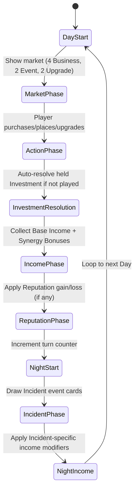
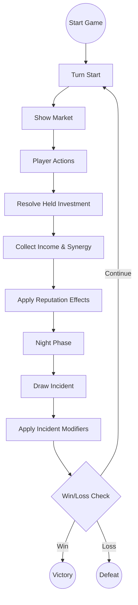

# Main Street: Core Rules and Mechanics

---

## 1. Game Overview

**Main Street** is a single‑player, turn‑based tableau card game built on the **Tableau Card Engine**. The player takes the role of a town planner revitalising a small main street by purchasing and placing business cards in a linear row. Each turn represents a day (or night) cycle. Adjacent businesses generate synergy bonuses, earn coins, and increase the town’s reputation. The game ends after a fixed number of turns or when a win condition is met. The design prioritises a fast‑to‑prototype core loop while delivering reusable engine components (grid, adjacency resolver, market, resource bank).

---

## 2. Core Concepts

| Concept | Definition |
|---------|------------|
| **Slot** | A single cell in the 10‑slot linear **Street Grid** where a Business card may be placed. Slots are indexed 0‑9.
| **Business Card** | A card representing a shop or service. It has a cost, a base income, one or more **Synergy Types**, and optional **Upgrade Paths**.
| **Synergy Type** | A tag (e.g., *Food*, *Culture*, *Commerce*) that determines adjacency bonuses. When two adjacent businesses share a synergy type, each gains a **Synergy Bonus** of +1 coin per turn per matching neighbor.
| **Market** | The face‑up row of cards the player may purchase each turn. It draws from three decks: **Business**, **Event**, and **Upgrade**.
| **Resource Bank** | Holds the player’s **Coins** (currency) and **Reputation** (score multiplier). Both start at a defined amount and change each turn.
| **Turn** | A full day/night cycle consisting of several phases (see Section 5). Turn number increments after the **Night Phase**.
| **Event Card** | A card that triggers a one‑off effect (e.g., Festival, Tax, Storm). **Investment** events are player‑bought and held until played; **Incident** events happen automatically.
| **Upgrade Card** | A card that modifies a specific Business card (e.g., upgrade a Bakery to a Patisserie, increasing income and synergy range).
| **Challenge** | A optional meta‑goal (e.g., *Build a Foodie Row*) that grants a bonus score at the end of the game if satisfied.

---

## 3. Card Types and Anatomy

### 3.1 Business Card

| Field | Type | Description |
|-------|------|-------------|
| **Name** | string | Human‑readable title (e.g., *Bakery*). |
| **Cost** | number (coins) | Purchase price from the market. |
| **Base Income** | number (coins per turn) | Income generated each **Day Phase** before synergy. |
| **Synergy Types** | string[] | One or more tags that interact with adjacent cards (e.g., `Food`). |
| **Upgrade Path** | string (optional) | Identifier of the Upgrade card that can transform this business. |
| **Max Level** | number (optional) | Number of upgrade steps (default 1). |
| **Description** | string | Flavor text and any special rules. |

**Example Business Card (JSON‑like)**
```json
{
  "name": "Bakery",
  "cost": 3,
  "baseIncome": 2,
  "synergyTypes": ["Food"],
  "upgradePath": "Bakery→Patisserie",
  "description": "Provides warm pastries. Gains +1 coin for each adjacent Food business."
}
```

### 3.2 Event Card

| Field | Type | Description |
|-------|------|-------------|
| **Name** | string | Title of the event (e.g., *Local Festival*). |
| **Trigger** | enum {`Investment`, `Incident`} | When the event resolves. **Investment** events are player‑bought (generally positive) and held until played. **Incident** events happen automatically (generally negative). |
| **Effect** | string (DSL) | Human‑readable description of the effect (e.g., `+2 coins to all Food businesses`). |
| **Target** | enum {`All`, `SpecificSynergy`, `RandomBusiness`} | Scope of the effect. |

**Example Event Card**
```json
{
  "name": "Local Festival",
  "trigger": "Incident",
  "effect": "+2 coins to all Culture businesses for this turn.",
  "target": "SpecificSynergy"
}
```

### 3.3 Upgrade Card

| Field | Type | Description |
|-------|------|-------------|
| **Name** | string | Title (e.g., *Upgrade to Patisserie*). |
| **Target Business** | string | Exact name of the business this upgrade applies to. |
| **Cost** | number (coins) | Purchase price from the market. |
| **Income Bonus** | number (coins) | Additional income added to the base income after upgrade. |
| **Synergy Range Bonus** | number (optional) | Extends the adjacency range for synergy (e.g., from 1 slot to 2 slots). |
| **Description** | string | Flavor text. |

**Example Upgrade Card**
```json
{
  "name": "Upgrade to Patisserie",
  "targetBusiness": "Bakery",
  "cost": 4,
  "incomeBonus": 1,
  "synergyRangeBonus": 1,
  "description": "Turns a Bakery into a Patisserie, increasing income and allowing synergy with businesses two slots away."
}
```

---

## 4. Game State Model

The engine maintains a single **GameState** object with the following fields (illustrated in TypeScript for reference):

```ts
interface GameState {
  turn: number; // starts at 1
  dayPhase: 'Day' | 'Night';
  streetGrid: (BusinessCard | null)[]; // length = GRID_SIZE (default 10)
  market: MarketRow; // 4 visible slots per deck type
  resourceBank: {
    coins: number; // start = 8
    reputation: number; // start = 0
  };
  deck: {
    business: CardDeck<BusinessCard>;
    event: CardDeck<EventCard>;
    upgrade: CardDeck<UpgradeCard>;
  };
  challengesCompleted: Set<string>; // IDs of achieved challenges
}
```

**Key components**
- **Grid<T>** – generic NxM grid (used here as 1x10). Provides `place(card, index)`, `neighbors(index)` utilities.
- **AdjacencyResolver** – computes synergy bonuses based on shared `synergyTypes` and proximity (default range 1, can be extended by upgrades).
- **MarketRow** – draws the top card from each deck to a face‑up row of 4 cards; cards are replenished after purchase.
- **ResourceBank** – tracks `coins` and `reputation`. Reputation is a multiplier applied at final score calculation (`finalScore = coins + reputation * 5 + challengeBonuses`).

---

## 5. Turn / Round Structure

The turn follows a deterministic state‑machine that repeats each day/night cycle. The diagram below is a Mermaid **state diagram** that doubles as a flowchart for designers and developers.



**Phase details**
1. **DayStart** – Increment `turn` counter, reset temporary flags.
2. **MarketPhase** – The market draws up to four Business cards, two Event cards, and two Upgrade cards. The player may purchase any combination as long as they have enough coins.
3. **ActionPhase** – The player resolves purchases:
   - **Buy Business** → `resourceBank.coins -= cost` → place card into a chosen empty slot.
   - **Buy Upgrade** → `resourceBank.coins -= cost` → apply upgrade effects to the targeted Business.
   - **Buy Event (Investment)** → `resourceBank.coins -= cost` → hold the event (max 1 held at a time). The player may play the held Investment during MarketPhase via a `play-event` action.
   - **Play Held Investment** → resolve the held Investment event immediately and clear it.
4. **InvestmentResolution** – If the player still holds an Investment event, it auto‑resolves here.
5. **IncomePhase** – For each placed Business, compute:
   - `totalIncome = baseIncome + synergyBonus` where `synergyBonus = countMatchingNeighbors * 1`.
   - `resourceBank.coins += totalIncome`.
6. **ReputationPhase** – Certain actions (e.g., completing a Challenge) increase `reputation`. Negative events may decrease it.
7. **NightStart** – Marks the transition to the Night.
8. **IncidentPhase** – Draw a single Incident event card from the Event deck and resolve it immediately.
9. **NightIncome** – Some Incident events modify income (e.g., *Rainy Night* reduces Food income by 1).
10. Loop back to **DayStart** for the next turn.

The turn ends when either:
- The predefined maximum turn count (`MAX_TURNS = 20`) is reached, **or**
- The player meets a **Win Condition** (Section 7), **or**
- A **Loss Condition** (Section 8) triggers.

---

## 6. Core Actions

| Action | Description | Preconditions | Result |
|--------|-------------|---------------|--------|
| **Buy Business** | Spend coins to acquire a Business card from the market and place it on an empty slot. | Market contains Business card; `resourceBank.coins >= cost`; at least one empty slot. | Business placed; coins deducted; slot becomes occupied. |
| **Buy Upgrade** | Spend coins to upgrade an existing Business card. | Market contains Upgrade card targeting a placed Business; `resourceBank.coins >= cost`. | Business card upgraded (income bonus and/or synergy range increased); coins deducted. |
| **Buy Event** | Spend coins to acquire an Investment event card and hold it. | Market contains Investment event card; `resourceBank.coins >= cost`; no event currently held (`heldEvent === null`). | Event held; coins deducted. Player may play it during MarketPhase or it auto‑resolves during InvestmentResolution. |
| **Play Held Event** | Play the held Investment event during MarketPhase. | Player holds an Investment event (`heldEvent !== null`); current phase is MarketPhase. | Held event resolved; `heldEvent` cleared to null. |
| **Place Business** | Choose an empty slot and put the purchased Business card there. | Business card in hand; slot is empty. | Card is now part of `streetGrid`. |
| **Resolve Event** | Apply the effect described on an Event card. | Event card active. | Game state mutated per effect (coins, reputation, temporary modifiers). |
| **End Turn** | Transition to the next phase/state. | All desired actions for the day are complete. | Turn counter increments, flow moves to Night or next Day. |

---

## 7. Win Conditions

The game is considered **won** when **any** of the following conditions are satisfied **at the end of a Night Phase**:

1. **Score Threshold** – `finalScore >= 150` where:
   ```ts
   finalScore = resourceBank.coins + resourceBank.reputation * 5 + challengeBonus;
   // challengeBonus = sum of 10 points per completed Challenge.
   ```
2. **Challenge Completion** – All **Primary Challenges** (defined in `docs/games/the-build/challenges.md`) are completed, granting an automatic win regardless of numeric score.
3. **Turn Limit Victory** – The player reaches **Turn 20** with a **positive reputation** (`reputation > 0`) and **coins >= 0**; the final score is then evaluated against the threshold. If the threshold is not met, the game ends as a loss.

All win conditions are **deterministic** given the same seed, ensuring testability.

---

## 8. Loss Conditions

The game ends in **loss** if **any** of the following occur **immediately after a phase**:

- **Bankruptcy** – `resourceBank.coins < 0`.
- **Reputation Collapse** – `resourceBank.reputation <= 0` (the town is considered abandoned).
- **Turn Exhaustion Without Victory** – Turn 20 is reached and none of the win conditions in Section 7 are met.

Loss conditions are evaluated at the end of the **Night Income** phase before checking win conditions, guaranteeing a clear order of evaluation.

---

## 9. Randomness and Information

| Aspect | Random Source | Visibility |
|--------|----------------|------------|
| **Market Draw** | Seeded RNG draws the top card from each of the three decks. | Face‑up – player sees all options before purchasing.
| **Event Cards** | Incident events are drawn automatically after the player’s actions and revealed before resolution. Investment events are purchased from the market and held until played. | Incidents: face‑up after draw. Investments: face‑up in market, then held.
| **Challenge Generation** | Fixed set defined in `challenges.md`; no randomness.
| **RNG Seed** | Determined by the **Game Engine** on startup (`Math.seedrandom(seedString)`). | The seed is displayed on the title screen for reproducibility.

All randomness is **deterministic** when the same seed is used, enabling automated testing of the core loop.

---

## Flowchart Summary

Below is a high‑level flowchart that captures the complete game loop, useful for documentation and onboarding of new developers.



---

**Document status**: AWAITING PRODUCER REVIEW.

*Prepared by*: `opencode` – implementation of work item **CG-0MM4RC1K81JU4U5D**.
