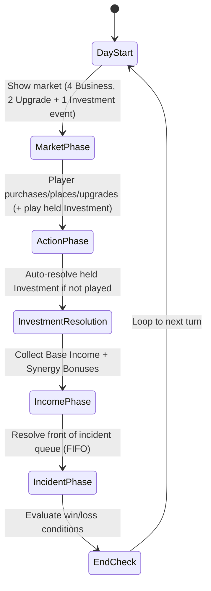
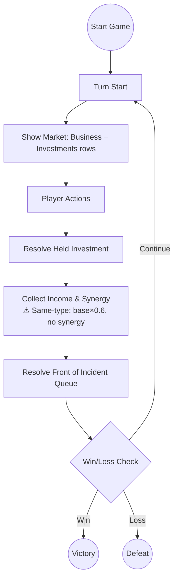

# Main Street: Core Rules and Mechanics

---

## 1. Game Overview

**Main Street** is a single‑player, turn‑based tableau card game built on the **Tableau Card Engine**. The player takes the role of a town planner revitalising a small main street by purchasing and placing business cards in a linear row. Each turn represents a day (or night) cycle. Adjacent businesses generate synergy bonuses, earn coins, and increase the town’s reputation. The game ends after a fixed number of turns or when a win condition is met. The design prioritises a fast‑to‑prototype core loop while delivering reusable engine components (grid, adjacency resolver, market, resource bank).

---

## 2. Core Concepts

| Concept | Definition |
|---------|------------|
| **Slot** | A single cell in the 10‑slot linear **Street Grid** where a Business card may be placed. Slots are indexed 0‑9.
| **Business Card** | A card representing a shop or service. It has a cost, a base income, one or more **Synergy Types**, and optional **Upgrade Paths**.
| **Synergy Type** | A tag (e.g., *Food*, *Culture*, *Commerce*) that determines adjacency bonuses. When two adjacent businesses share a synergy type and are of **different base types** (different template IDs), each gains a **Synergy Bonus** equal to a percentage of its own effective base income per matching neighbor. The per-card synergy rate defaults to 50% (0.5) and is configurable via `synergyCoinBonus`. Same-type adjacent businesses do not receive synergy from each other.
| **Market** | The face‑up cards the player may purchase each turn. It has two rows: a **Business** row (4 slots) and a mixed **Investments** row (2 Upgrade cards + 1 Investment event card = 3 slots). Incidents are not purchasable; they populate a visible FIFO **Incident Queue** instead.
| **Resource Bank** | Holds the player's **Coins** (currency) and **Reputation** (score multiplier). Coins start at 8 and Reputation starts at 3.
| **Turn** | A full day/night cycle consisting of several phases (see Section 5). Turn number increments after the **Night Phase**.
| **Event Card** | A card that triggers a one‑off effect (e.g., Festival, Tax, Storm). **Investment** events are player‑bought from the Investments row and held until played; **Incident** events resolve automatically from the incident queue.
| **Incident Queue** | A visible FIFO queue of 2 face‑up Incident cards. Each turn the front card is resolved and a replacement is drawn from the event deck. The player can see upcoming incidents and plan accordingly.
| **Upgrade Card** | A card that modifies a specific Business card (e.g., upgrade a Bakery to a Patisserie, increasing income and synergy range).
| **Challenge** | A optional meta‑goal (e.g., *Build a Foodie Row*) that grants a bonus score at the end of the game if satisfied.

---

## 3. Card Types and Anatomy

### 3.1 Business Card

| Field | Type | Description |
|-------|------|-------------|
| **Name** | string | Human‑readable title (e.g., *Bakery*). |
| **Cost** | number (coins) | Purchase price from the market. |
| **Base Income** | number (coins per turn) | Income generated each **Day Phase** before synergy. |
| **Synergy Types** | string[] | One or more tags that interact with adjacent cards (e.g., `Food`). |
| **Upgrade Path** | string (optional) | Identifier of the Upgrade card that can transform this business. |
| **Max Level** | number (optional) | Number of upgrade steps (default 1). |
| **Reputation Per Turn** | number (optional) | Reputation contributed each turn during IncomePhase (e.g., Clinic provides +0.2 rep/turn). Default 0. |
| **Description** | string | Flavor text and any special rules. |

**Example Business Card (JSON‑like)**
```json
{
  "name": "Bakery",
  "cost": 3,
  "baseIncome": 2,
  "synergyTypes": ["Food"],
  "upgradePath": "Bakery→Patisserie",
  "description": "Provides warm pastries. Gains +1 coin for each adjacent Food business."
}
```

### 3.2 Event Card

| Field | Type | Description |
|-------|------|-------------|
| **Name** | string | Title of the event (e.g., *Local Festival*). |
| **Trigger** | enum {`Investment`, `Incident`} | When the event resolves. **Investment** events are player‑bought (generally positive) and held until played. **Incident** events happen automatically (generally negative). |
| **Effect** | string (DSL) | Human‑readable description of the effect (e.g., `+2 coins to all Food businesses`). |
| **Target** | enum {`All`, `SpecificSynergy`, `RandomBusiness`} | Scope of the effect. |

**Example Event Card**
```json
{
  "name": "Local Festival",
  "trigger": "Investment",
  "effect": "+2 coins to all Culture businesses and +1 reputation.",
  "target": "SpecificSynergy"
}
```

### 3.3 Upgrade Card

| Field | Type | Description |
|-------|------|-------------|
| **Name** | string | Title (e.g., *Upgrade to Patisserie*). |
| **Target Business** | string | Exact name of the business this upgrade applies to. |
| **Cost** | number (coins) | Purchase price from the market. |
| **Income Bonus** | number (coins) | Additional income added to the base income after upgrade. |
| **Reputation Bonus** | number (optional) | Additional reputation contributed each turn (e.g., Medical Center provides +0.1 rep/turn). Default 0. |
| **Synergy Range Bonus** | number (optional) | Extends the adjacency range for synergy (e.g., from 1 slot to 2 slots). |
| **Description** | string | Flavor text. |

**Example Upgrade Card**
```json
{
  "name": "Upgrade to Patisserie",
  "targetBusiness": "Bakery",
  "cost": 4,
  "incomeBonus": 1,
  "synergyRangeBonus": 1,
  "description": "Turns a Bakery into a Patisserie, increasing income and allowing synergy with businesses two slots away."
}
```

### 3.4 Community Space Card

Community space cards (e.g. Park, Library) are a separate card family (`community-space`) placed on the street grid alongside business cards. They share the same mechanical behavior as businesses (grid placement, synergy bonuses, upgrade path, level tracking) but are classified differently for thematic clarity.

| Field | Type | Description |
|-------|------|-------------|
| **Name** | string | Human‑readable title (e.g., *Library*). |
| **Cost** | number (coins) | Purchase price from the market. |
| **Base Income** | number (coins per turn) | Income generated each **IncomePhase** before synergy. Some community spaces earn no income at all (e.g. Library `baseIncome = 0`). |
| **Ongoing Cost** | number (coins per turn) | Per‑turn running cost deducted each **IncomePhase** (e.g. Library costs 0.25 coins/turn to run). Defaults to 0. Mirrors the StaffCard `ongoingCost` mechanic. |
| **Reputation Per Turn** | number (optional) | Reputation contributed each turn during IncomePhase (e.g. Library provides +0.1 rep/turn). Default 0. |
| **Synergy Types** | string[] | One or more tags that interact with adjacent cards (e.g., `Culture`). |
| **Upgrade Path** | string (optional) | Identifier of the Upgrade card that can transform this community space. |
| **Max Level** | number (optional) | Number of upgrade steps (default 1). |
| **Description** | string | Flavor text and any special rules. |

> **Ongoing costs are deducted in the IncomePhase.** Community spaces with `ongoingCost > 0` have their total running cost deducted from coins each turn (after income is credited, alongside staff card costs). The deduction is **clamped at 0 coins** — the player is never driven below zero — and both the deduction and any shortfall are logged to the activity log.

---

## 4. Game State Model

The engine maintains a single **GameState** object with the following fields (illustrated in TypeScript for reference):

```ts
interface GameState {
  turn: number; // starts at 1
  dayPhase: 'Day' | 'Night';
  streetGrid: (BusinessCard | null)[]; // length = GRID_SIZE (default 10)
  market: {
    business: BusinessCard[];                   // 4 face-up slots
    investments: (UpgradeCard | EventCard)[];   // 2 upgrades + 1 investment event = 3 slots
  };
  incidentQueue: EventCard[];  // Visible FIFO queue of upcoming Incidents (size 2)
  resourceBank: {
    coins: number; // start = 8
    reputation: number; // start = 3
  };
  deck: {
    business: CardDeck<BusinessCard>;
    event: CardDeck<EventCard>;    // Contains both Investment and Incident cards
    upgrade: CardDeck<UpgradeCard>;
  };
  heldEvent: EventCard | null;  // Held Investment event awaiting play (max 1)
  challengesCompleted: Set<string>; // IDs of achieved challenges
}
```

**Key components**
- **Grid<T>** – generic NxM grid (used here as 1x10), now using the reusable `@core-engine` `Grid` type.
- **AdjacencyResolver** – computes synergy bonuses based on shared `synergyTypes` and proximity (default range 1, can be extended by upgrades) via `@core-engine/SpatialRules`.
- **Market** – two rows: Business row (4 face‑up cards from the Business deck) and Investments row (2 Upgrades + 1 Investment event = 3 slots). Cards are replenished after purchase.
- **Incident Queue** – visible FIFO queue of 2 Incident cards drawn from the event deck. The front card resolves each turn during IncidentPhase; a replacement is drawn from the deck afterward. If the deck runs out, the queue shrinks naturally.
- **ActiveEffect System** – some events (e.g. `evt-flu-outbreak`) create duration-based modifiers instead of one-shot deltas. ActiveEffects are tracked in `state.activeEffects: ActiveEffect[]` and decay each turn during EndCheck. See [ActiveEffect System](#-activeeffect-system) below.
- **ResourceBank** – tracks `coins` (start 8) and `reputation` (start 3). Reputation can increase during the IncomePhase via `reputationPerTurn` from certain Health-synergy cards (e.g. Clinic provides +0.2 rep/turn). Reputation is also a multiplier applied at final score calculation (`finalScore = coins + reputation * 5 + challengeBonuses`).

### Spatial API migration note

Main Street keeps the same external behavior for linear adjacency (`neighbors(index, range = 1)`), but internally now adapts the street to a `10x1` `Grid` and calls `neighbors()` from `@core-engine/SpatialRules` with Manhattan distance and orthogonal-only traversal. This preserves all existing gameplay behavior and tests while enabling shared NxM spatial logic for future games.

---

## 5. Turn / Round Structure

The turn follows a deterministic state‑machine that repeats each day/night cycle. The diagram below is a Mermaid **state diagram** that doubles as a flowchart for designers and developers.



**Phase details**
1. **DayStart** – Increment `turn` counter, reset temporary flags, replenish market.
2. **MarketPhase** – The market shows 4 Business cards and 3 Investments (2 Upgrades + 1 Investment event). The player may purchase any combination as long as they have enough coins.
3. **ActionPhase** – The player resolves purchases:
   - **Buy Business** → `resourceBank.coins -= cost` → place card into a chosen empty slot.
   - **Buy Upgrade** → `resourceBank.coins -= cost` → apply upgrade effects to the targeted Business.
   - **Buy Event (Investment)** → hold the event (max 1 held at a time). The player may play the held Investment during MarketPhase via a `play-event` action.
   - **Play Held Investment** → resolve the held Investment event immediately and clear it.
4. **InvestmentResolution** – If the player still holds an Investment event, it auto‑resolves here.
5. **IncomePhase** – For each placed Business, compute:
   - `totalIncome = effectiveBase + synergyBonus`, where `effectiveBase = (baseIncome + incomeBonus) × sameTypePenalty` and `synergyBonus = effectiveBase × synergyCoinBonus × synergyBonusPerNeighbor × N`. Synergy uses a percentage-based formula: each matching neighbor contributes a percentage of the source business's effective base income, scaled by the difficulty preset multiplier. Synergy is only earned from adjacent neighbors of **different base types** (template IDs). Same-type adjacent businesses: synergy is nullified (0 contribution), and base income (including any income bonus from upgrades) is reduced to **60%**.
   - `resourceBank.coins += totalIncome`.
   - `totalReputationPerTurn` is calculated from all placed cards (some Health-synergy cards like the Clinic provide `reputationPerTurn`). Upgrades may also contribute `reputationBonus`. Synergy reputation from adjacent neighbors is only earned from **different-type** businesses; same-type neighbors contribute 0 reputation synergy.
   - `resourceBank.reputation += totalReputationPerTurn`.
   - **Ongoing costs** (staff cards and community-space cards with `ongoingCost > 0`, e.g. the Library's 0.25 coins/turn) are deducted from coins after income. Deductions are clamped at 0 coins (the player is never driven below zero) and logged.
6. **IncidentPhase** – Resolve the front Incident card from the visible FIFO incident queue. After resolution, draw a replacement Incident from the event deck to the back of the queue (maintaining queue size of 2). If the deck has no more Incidents, the queue shrinks naturally.
7. **EndCheck** – Evaluate win/loss conditions.
8. Loop back to **DayStart** for the next turn.

The turn ends when either:
- The predefined maximum turn count (`MAX_TURNS = 20`) is reached, **or**
- The player meets a **Win Condition** (Section 7), **or**
- A **Loss Condition** (Section 8) triggers.

---

## 6. Core Actions

| Action | Description | Preconditions | Result |
|--------|-------------|---------------|--------|
| **Buy Business** | Spend coins to acquire a Business card from the market and place it on an empty slot. | Market contains Business card; `resourceBank.coins >= cost`; at least one empty slot. | Business placed; coins deducted; slot becomes occupied. |
| **Buy Upgrade** | Spend coins to upgrade an existing Business card. | Market contains Upgrade card targeting a placed Business; `resourceBank.coins >= cost`. | Business card upgraded (income bonus and/or synergy range increased); coins deducted. |
| **Buy Event** | Spend coins to acquire an Investment event card and hold it. | Market contains Investment event card; `resourceBank.coins >= cost`; no event currently held (`heldEvent === null`). | Event held; coins deducted. Player may play it during MarketPhase or it auto‑resolves during InvestmentResolution. |
| **Play Held Event** | Play the held Investment event during MarketPhase. | Player holds an Investment event (`heldEvent !== null`); current phase is MarketPhase. | Held event resolved; `heldEvent` cleared to null. |
| **Place Business** | Choose an empty slot and put the purchased Business card there. | Business card in hand; slot is empty. | Card is now part of `streetGrid`. |
| **Resolve Event** | Apply the effect described on an Event card. | Event card active. | Game state mutated per effect (coins, reputation, temporary modifiers). |
| **End Turn** | Transition to the next phase/state. | All desired actions for the day are complete. | Turn counter increments, flow moves to Night or next Day. |

---

## 7. Win Conditions

The game is considered **won** when **any** of the following conditions are satisfied **at the end of a Night Phase**:

1. **Score Threshold** – `finalScore >= 150` where:
   ```ts
   finalScore = resourceBank.coins + resourceBank.reputation * 5 + challengeBonus;
   // challengeBonus = sum of 10 points per completed Challenge.
   ```
2. **Challenge Completion** – All **Primary Challenges** (defined in `docs/games/the-build/challenges.md`) are completed, granting an automatic win regardless of numeric score.
3. **Turn Limit Victory** – The player reaches **Turn 20** with a **positive reputation** (`reputation > 0`) and **coins >= 0**; the final score is then evaluated against the threshold. If the threshold is not met, the game ends as a loss.

All win conditions are **deterministic** given the same seed, ensuring testability.

---

## 8. Loss Conditions

The game ends in **loss** if **any** of the following occur **immediately after a phase**:

- **Bankruptcy** – `resourceBank.coins < 0`.
- **Reputation Collapse** – `resourceBank.reputation <= 0` (the town is considered abandoned).
- **Turn Exhaustion Without Victory** – Turn 20 is reached and none of the win conditions in Section 7 are met.

Loss conditions are evaluated at the end of the **Night Income** phase before checking win conditions, guaranteeing a clear order of evaluation.

---

## 9. Randomness and Information

| Aspect | Random Source | Visibility |
|--------|----------------|------------|
| **Market Draw** | Seeded RNG draws from the Business, Upgrade, and Event decks to fill the Business row (4 slots) and Investments row (2 Upgrades + 1 Investment event). | Face‑up – player sees all options before purchasing.
| **Event Cards** | Incident events populate a visible FIFO queue (2 cards, face‑up) so the player can plan ahead. Investment events appear in the Investments market row and are purchased/held until played. | Incidents: face‑up in queue. Investments: face‑up in market, then held.
| **Challenge Generation** | Fixed set defined in `challenges.md`; no randomness.
| **RNG Seed** | Determined by the **Game Engine** on startup (`Math.seedrandom(seedString)`). | The seed is displayed on the title screen for reproducibility.

All randomness is **deterministic** when the same seed is used, enabling automated testing of the core loop.

---

## Flowchart Summary

Below is a high‑level flowchart that captures the complete game loop, useful for documentation and onboarding of new developers.



---

## 9. ActiveEffect System (Duration-Based Modifiers)

Certain events (e.g., `evt-flu-outbreak`) create **ActiveEffect** instances that modify game parameters over multiple turns instead of applying one-shot coin/reputation deltas.

### ActiveEffect Data Structure

Each ActiveEffect tracks:
- **`effectType`** – discriminator (e.g. `income-multiplier`)
- **`multiplier`** – scalar applied (e.g. `0.8` for 80% income)
- **`turnsRemaining`** – number of turns before the effect expires
- **`sourceEventId`** – the card/event ID that created the effect
- **`description`** – human-readable summary for logging/UI

### Storage

ActiveEffects are stored in `state.activeEffects: ActiveEffect[]` (part of `MainStreetState`). The array is serialized/deserialized for save/load; missing field in old saves defaults to `[]`.

### Turn Flow

1. **IncomePhase** – `applyIncome()` checks `state.activeEffects` for `income-multiplier` effects and applies the multiplier per-slot *before* the reputation multiplier.
2. **EndCheck** – `decayActiveEffects()` decrements `turnsRemaining` on all active effects. Effects that reach 0 are removed and logged.

### Example: Flu Outbreak (`evt-flu-outbreak`)

- **Trigger**: Incident (automatic draw from incident queue)
- **Base duration**: 5 turns
- **Effect**: All businesses generate 80% income (0.8× multiplier)
- **Duration reduction**: If a Clinic (`biz-clinic`) is on the street grid, duration → 3 turns. If a Medical Center (`upg-medical-center`) is present, duration → 2 turns. Only the stronger reduction applies.
- **Minimum duration**: 1 turn (floor)
- **Income application**: The 0.8× multiplier is applied to each slot's base + synergy income *before* the reputation coin multiplier.

### Extensibility

The ActiveEffect system is designed for future duration-based events. New effect types can be added by using a new `effectType` string and implementing the corresponding modifier in the relevant game computation function.

---

**Document status**: AWAITING PRODUCER REVIEW.

*Prepared by*: `opencode` – implementation of work item **CG-0MM4RC1K81JU4U5D**.
