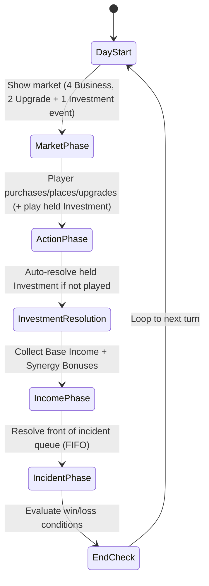

# The Build: Game Design Document (GDD)

> **Status update (CG-0MSLXJCHH001DLIO):** This historical GDD describes the original 20-turn design (``MAX_TURNS = 20``, "Turn 20" win/loss conditions). Default difficulty presets no longer impose a turn limit — games end via score threshold, all challenges, bankruptcy, or reputation collapse; a turn limit is opt-in via an explicit `maxTurns` config. See `docs/main-street/core-rules-and-mechanics.md` for the current rules. The 20-turn references below are retained for historical accuracy.

## Executive Summary

**Main Street** (working title: *The Build*) is a single-player, turn-based tableau card game where the player revitalises a 10-slot street grid by purchasing and placing business cards from a market. Adjacent (including diagonally adjacent) businesses sharing synergy types generate bonus income. The player manages two resources (Coins and Reputation) across 20 day/night turns, aiming to reach a difficulty-scaled score threshold (100 Easy / 120 Medium / 150 Hard) or complete all challenges. The game is built on the Tableau Card Engine using Phaser 3, TypeScript, and seeded deterministic RNG for reproducible sessions.

## Table of Contents
1. [Core Rules and Mechanics](#core-rules-and-mechanics)
2. [Content Design and Progression](#content-design-and-progression)
3. [UX, Visual Design, and Audio Direction](#ux-visual-design-and-audio-direction)
4. [AI Strategy and Hint System](#ai-strategy-and-hint-system)
5. [Glossary](#glossary)
6. [Milestone PRDs](#milestone-prds)

---

## 1. Core Rules and Mechanics

# Main Street: Core Rules and Mechanics

---

## 1. Game Overview

**Main Street** is a single‑player, turn‑based tableau card game built on the **Tableau Card Engine**. The player takes the role of a town planner revitalising a small main street by purchasing and placing business cards in a 10‑slot street grid. Each turn represents a day (or night) cycle. Adjacent (including diagonally adjacent) businesses generate synergy bonuses, earn coins, and increase the town’s reputation. The game ends after a fixed number of turns or when a win condition is met. The design prioritises a fast‑to‑prototype core loop while delivering reusable engine components (grid, adjacency resolver, market, resource bank).

> **Update (CG-0MSLXJCHH001DLIO):** "Fixed number of turns" describes the original design; there is no default turn limit anymore.

---

## 2. Core Concepts

| Concept | Definition |
|---------|------------|
| **Slot** | A single cell in the 10‑slot **Street Grid** (rendered as a 2‑row × 5‑column layout) where a Business card may be placed. Slots are indexed 0‑9.
| **Business Card** | A card representing a shop or service. It has a cost, a base income, one or more **Synergy Types**, and optional **Upgrade Paths**.
| **Synergy Type** | A tag (e.g., *Food*, *Culture*, *Commerce*) that determines adjacency bonuses. When two adjacent businesses — orthogonally or **diagonally adjacent** (8‑way / Chebyshev adjacency, default range 1) — share a synergy type, each gains a **Synergy Bonus** equal to a percentage of its own effective base income per matching neighbor. The per-card rate defaults to 50% (`synergyCoinBonus` 0.5) and is scaled by the difficulty preset multiplier `synergyBonusPerNeighbor` (Easy 0.5 / Medium 0.35 / Hard 0.25, re-tuned by CG-0MSP26Q5N002EH8P). Same-type adjacent businesses do not receive synergy from each other.
| **Market** | The face‑up cards the player may purchase each turn. It has two rows: a **Business** row (4 slots) and a mixed **Investments** row (2 Upgrade cards + 1 Investment event card = 3 slots). Incidents are not purchasable; they populate a visible FIFO **Incident Queue** instead.
| **Resource Bank** | Holds the player's **Coins** (currency) and **Reputation** (plain score count). Coins start at 8 and Reputation starts at 3.
| **Turn** | A full day/night cycle consisting of several phases (see Section 5). Turn number increments after the **Night Phase**.
| **Event Card** | A card that triggers a one‑off effect (e.g., Festival, Tax, Storm). **Investment** events are player‑bought from the Investments row and held until played; **Incident** events resolve automatically from the incident queue.
| **Incident Queue** | A visible FIFO queue of 2 face‑up Incident cards. Each turn the front card is resolved and a replacement is drawn from the event deck. The player can see upcoming incidents and plan accordingly.
| **Upgrade Card** | A card that modifies a specific Business card (e.g., upgrade a Bakery to a Patisserie, increasing income and synergy range).
| **Challenge** | An optional meta‑goal (e.g., *Build a Foodie Row*) that grants a bonus score at the end of the game if satisfied.

---

## 3. Card Types and Anatomy

### 3.1 Business Card

| Field | Type | Description |
|-------|------|-------------|
| **Name** | string | Human‑readable title (e.g., *Bakery*). |
| **Cost** | number (coins) | Purchase price from the market. |
| **Base Income** | number (coins per turn) | Income generated each **Day Phase** before synergy. |
| **Synergy Types** | string[] | One or more tags that interact with adjacent cards (e.g., `Food`). |
| **Upgrade Path** | string (optional) | Identifier of the Upgrade card that can transform this business. |
| **Max Level** | number (optional) | Number of upgrade steps (default 1). |
| **Description** | string | Flavor text and any special rules. |

**Example Business Card (JSON‑like)**
```json
{
  "name": "Bakery",
  "cost": 3,
  "baseIncome": 2,
  "synergyTypes": ["Food"],
  "upgradePath": "Bakery→Patisserie",
  "description": "Provides warm pastries. Gains {SYNERGY_RATE} of base income per adjacent Food business."
}
```

### 3.2 Event Card

| Field | Type | Description |
|-------|------|-------------|
| **Name** | string | Title of the event (e.g., *Local Festival*). |
| **Trigger** | enum {`Investment`, `Incident`} | When the event resolves. **Investment** events are player-bought (generally positive) and held until played. **Incident** events happen automatically (generally negative). |
| **Effect** | string (DSL) | Human‑readable description of the effect (e.g., `+2 coins to all Food businesses`). |
| **Target** | enum {`All`, `SpecificSynergy`, `RandomBusiness`} | Scope of the effect. |

**Example Event Card**
```json
{
  "name": "Local Festival",
  "trigger": "Investment",
  "effect": "+2 coins to all Culture businesses and +1 reputation.",
  "target": "SpecificSynergy"
}
```

### 3.3 Upgrade Card

| Field | Type | Description |
|-------|------|-------------|
| **Name** | string | Title (e.g., *Upgrade to Patisserie*). |
| **Target Business** | string | Exact name of the business this upgrade applies to. |
| **Cost** | number (coins) | Purchase price from the market. |
| **Income Bonus** | number (coins) | Additional income added to the base income after upgrade. |
| **Synergy Range Bonus** | number (optional) | Extends the adjacency range for synergy (e.g., from 1 slot to 2 slots). |
| **Description** | string | Flavor text. |

**Example Upgrade Card**
```json
{
  "name": "Upgrade to Patisserie",
  "targetBusiness": "Bakery",
  "cost": 4,
  "incomeBonus": 1,
  "synergyRangeBonus": 1,
  "description": "Turns a Bakery into a Patisserie, increasing income and allowing synergy with businesses two slots away."
}
```

---

## 4. Game State Model

The engine maintains a single **GameState** object with the following fields (illustrated in TypeScript for reference):

```ts
interface GameState {
  turn: number; // starts at 1
  dayPhase: 'Day' | 'Night';
  streetGrid: (BusinessCard | null)[]; // length = GRID_SIZE (default 10)
  market: {
    business: BusinessCard[];                   // 4 face-up slots
    investments: (UpgradeCard | EventCard)[];   // 2 upgrades + 1 investment event = 3 slots
  };
  incidentQueue: EventCard[];  // Visible FIFO queue of upcoming Incidents (size 2)
  resourceBank: {
    coins: number; // start = 8
    reputation: number; // start = 3
  };
  deck: {
    business: CardDeck<BusinessCard>;
    event: CardDeck<EventCard>;    // Contains both Investment and Incident cards
    upgrade: CardDeck<UpgradeCard>;
  };
  hand: (BusinessCard | EventCard)[]; // merged hand: any mix, up to maxHandSize
  maxHandSize: number;                 // starts at 2, growable via staff upgrade cards
  challengesCompleted: Set<string>; // IDs of achieved challenges
}
```

**Key components**
- **Grid<T>** – generic NxM grid (used here as 2x5, storage row-major 0‑9). Provides `place(card, index)`, `neighbors(index)` (8‑way / Chebyshev adjacency) utilities.
- **AdjacencyResolver** – computes synergy bonuses based on shared `synergyTypes` and proximity (default range 1, can be extended by upgrades).
- **Market** – two rows: Business row (4 face‑up cards from the Business deck) and Investments row (2 Upgrades + 1 Investment event = 3 slots). Cards are replenished after purchase.
- **Incident Queue** – visible FIFO queue of 2 Incident cards drawn from the event deck. The front card resolves each turn during IncidentPhase; a replacement is drawn from the deck afterward. If the deck runs out, the queue shrinks naturally.
- **ResourceBank** – tracks `coins` (start 8) and `reputation` (start 3). Reputation counts 1:1 toward the final score (`finalScore = coins + reputation + challengeBonuses`).

---

## 5. Turn / Round Structure

The turn follows a deterministic state‑machine that repeats each day/night cycle. The diagram below is a Mermaid **state diagram** that doubles as a flowchart for designers and developers.



**Phase details**
1. **DayStart** – Increment `turn` counter, reset temporary flags, replenish market.
2. **MarketPhase** – The market shows 4 Business cards and 3 Investments (2 Upgrades + 1 Investment event). The player may purchase any combination as long as they have enough coins.
3. **ActionPhase** – The player resolves purchases:
   - **Buy Business** → `resourceBank.coins -= cost` → place card into a chosen empty slot.
   - **Buy Upgrade** → `resourceBank.coins -= cost` → apply upgrade effects to the targeted Business.
   - **Buy Event (Investment)** → add the event card to the player's hand (any mix of business/event cards up to `maxHandSize`). The player may play it during MarketPhase via a `play-event` action.
   - **Play Event (from hand)** → resolve an Investment event card from the hand immediately and remove it.
4. **InvestmentResolution** – Reserved phase; Investment events are **not** auto‑resolved here. Unplayed events persist in the hand until the player plays them during a later MarketPhase.
5. **IncomePhase** – For each placed Business, compute:
   - `totalIncome = effectiveBase + synergyBonus` where `effectiveBase = (baseIncome + incomeBonus) * sameTypePenalty` (0.6 for same-type neighbors) and `synergyBonus = effectiveBase * synergyCoinBonus * bonusPerNeighbor * matchingNeighborCount` (percentage-based: `synergyCoinBonus` is the card's rate, defaulting to 0.5 = 50% of base income per matching neighbor; `bonusPerNeighbor` is the difficulty multiplier — 0.5 Easy / 0.35 Medium / 0.25 Hard (re-tuned by CG-0MSP26Q5N002EH8P)). `matchingNeighborCount` counts 8‑way adjacent neighbors (orthogonal **and diagonal**, Chebyshev distance ≤ range).
   - `resourceBank.coins += totalIncome`.
6. **IncidentPhase** – Resolve the front Incident card from the visible FIFO incident queue. After resolution, draw a replacement Incident from the event deck to the back of the queue (maintaining queue size of 2). If the deck has no more Incidents, the queue shrinks naturally.
7. **EndCheck** – Evaluate win/loss conditions.
8. Loop back to **DayStart** for the next turn.

The turn ends when either:
- The predefined maximum turn count (`MAX_TURNS = 20`) is reached, **or**
- The player meets a **Win Condition** (Section 7), **or**
- A **Loss Condition** (Section 8) triggers.

> **Update (CG-0MSLXJCHH001DLIO):** The `MAX_TURNS = 20` end condition is no longer a default game mechanic — it fires only when a config explicitly sets `maxTurns`.

---

## 6. Core Actions

| Action | Description | Preconditions | Result |
|--------|-------------|---------------|--------|
| **Buy Business** | Spend coins to acquire a Business card from the market and place it on an empty slot. | Market contains Business card; `resourceBank.coins >= cost`; at least one empty slot. | Business placed; coins deducted; slot becomes occupied. |
| **Buy Upgrade** | Spend coins to upgrade an existing Business card. | Market contains Upgrade card targeting a placed Business; `resourceBank.coins >= cost`. | Business card upgraded (income bonus and/or synergy range increased); coins deducted. |
| **Buy Event** | Take an Investment event card from the market into the hand **for free** (cost is paid when the event is executed from hand). | Market contains Investment event card; hand has room (`hand.length < maxHandSize`). | Event appended to hand; **no coins deducted** at take time. Player pays the event's listed cost when it is played during MarketPhase. There is **no limit on the number of event cards** in hand — only hand capacity (`maxHandSize`) applies. |
| **Play Event (from hand)** | Play an Investment event card from the hand during MarketPhase. | Player holds an Investment event card in hand; current phase is MarketPhase. | Event resolved and removed from hand. |
| **Place Business** | Choose an empty slot and put the purchased Business card there. | Business card in hand; slot is empty. | Card is now part of `streetGrid`. |
| **Resolve Event** | Apply the effect described on an Event card. | Event card active. | Game state mutated per effect (coins, reputation, temporary modifiers). |
| **End Turn** | Transition to the next phase/state. | All desired actions for the day are complete. | Turn counter increments, flow moves to Night or next Day. |

---

## 7. Win Conditions

The game is considered **won** when **any** of the following conditions are satisfied **at the end of a Night Phase**:
1. **Score Threshold** – `finalScore >= winThreshold` where winThreshold is difficulty-scaled (100 Easy / 120 Medium / 150 Hard):
```ts
finalScore = resourceBank.coins + resourceBank.reputation + challengeBonus;
// challengeBonus = sum of 10 points per completed Challenge.
```
2. **Challenge Completion** – All **Primary Challenges** (defined in `docs/games/the-build/challenges.md`) are completed, granting an automatic win regardless of numeric score.
3. **Turn Limit Victory** – The player reaches **Turn 20** with a **positive reputation** (`reputation > 0`) and **coins >= 0**; the final score is then evaluated against the threshold. If the threshold is not met, the game ends as a loss.

> **Update (CG-0MSLXJCHH001DLIO):** Turn Limit Victory is opt-in — it only applies when a config explicitly sets `maxTurns`.

---

## 8. Loss Conditions

The game ends in **loss** if **any** of the following occur **immediately after a phase**:
- **Bankruptcy** – `resourceBank.coins < 0`.
- **Reputation Collapse** – `resourceBank.reputation <= 0` (the town is considered abandoned).
- **Turn Exhaustion Without Victory** – Turn 20 is reached and none of the win conditions in Section 7 are met.

> **Update (CG-0MSLXJCHH001DLIO):** Turn Exhaustion is opt-in — it only applies when a config explicitly sets `maxTurns`.

---

## 9. Randomness and Information

| Aspect | Random Source | Visibility |
|--------|----------------|------------|
| **Market Draw** | Seeded RNG draws from the Business, Upgrade, and Event decks to fill the Business row (4 slots) and Investments row (2 Upgrades + 1 Investment event). | Face‑up – player sees all options before purchasing.
| **Event Cards** | Incident events populate a visible FIFO queue (2 cards, face‑up) so the player can plan ahead. Investment events appear in the Investments market row and are purchased/held until played. | Incidents: face‑up in queue. Investments: face‑up in market, then held.
| **Challenge Generation** | Fixed set defined in `challenges.md`; no randomness.
| **RNG Seed** | Determined by the **Game Engine** on startup (`Math.seedrandom(seedString)`). | The seed is displayed on the title screen for reproducibility.

All randomness is **deterministic** when the same seed is used, enabling automated testing of the core loop.

---

## 10. Content Design and Progression

# Main Street: Content Design and Progression

---

### 1. Card Pool / Content Inventory

The **Main Street** game uses three distinct card families. Below is the current inventory of cards used in the prototype. The list is intentionally small for rapid iteration; additional cards can be added as the design evolves.

#### 1.1 Business Cards
| Name | Cost (coins) | Base Income (coins/turn) | Synergy Types | Upgrade Path | Description |
|------|--------------|--------------------------|----------------|--------------|-------------|
| Bakery | 3 | 2 | Food | Bakery → Patisserie | Provides warm pastries. Gains 50% of base income per adjacent Food business. |
| Diner | 4 | 3 | Food | Diner → Bistro | Serves quick meals. Gains 50% of base income per adjacent Food business. |
| Bookshop | 4 | 2 | Culture | Bookshop → Reader's Café | Sells books. Gains 50% of base income per adjacent Culture business. |
| Park | 2 | 1 | Culture | Park → Garden | Offers leisure. Gains 50% of base income per adjacent Culture business or community space. |
| Hardware Store | 5 | 3 | Commerce | Hardware Store → Home Improvement | Supplies tools. Gains 50% of base income per adjacent Commerce business. |
| ... *(additional business cards may be added later)* |

#### 1.2 Event Cards

Event cards are split into two trigger types:

- **Investment** events are purchased from the Investments market row, held by the player, and played (or auto-resolved) during the turn. They are generally positive.
- **Incident** events populate a visible FIFO queue and resolve automatically at the start of each turn's Incident Phase. They are generally negative or disruptive.

| Name | Trigger | Effect |
|------|---------|--------|
| Local Festival | Investment | +2 coins per Culture business and +1 reputation. |
| Tax Audit | Incident | Lose 3 coins. |
| Rainy Day | Incident | -1 coin per Food business this turn. |
| Community Award | Incident | +2 reputation from community recognition. |
| Health Inspection | Incident | -2 coins per Food business and -1 reputation. |

**Deck composition:** 5 event templates × 3 copies = 15 cards total (3 Investment, 12 Incident). At game start, the Investments market row draws 1 Investment event and the incident queue draws 2 Incidents from the shuffled event deck.

#### 1.3 Upgrade Cards
| Name | Target Business | Cost (coins) | Income Bonus | Synergy Range Bonus | Description |
|------|----------------|--------------|--------------|----------------------|-------------|
| Upgrade to Patisserie | Bakery | 4 | +1 | +1 (adjacency range) | Turns a Bakery into a Patisserie, increasing income and allowing synergy with businesses two slots away. |
| Upgrade to Bistro | Diner | 4 | +1 | +1 | Turns a Diner into a Bistro with higher foot‑traffic. |
| Upgrade to Reader's Café | Bookshop | 3 | +1 | 0 | Transforms the Bookshop into a Reader's Café, blending books with café culture for +0.1 reputation per turn. |
| ... *(more upgrades as new businesses are introduced)* |

---

## 2. Recipes / Blueprints

Main Street does **not** feature crafting or combination mechanics. The game revolves around purchasing, placing, and upgrading business cards. Therefore, the **Recipes / Blueprints** section is **N/A** for this title.

---

## 3. Resource Economy

The core economic loop consists of two primary resources:
1. **Coins** – the spendable currency used to purchase Business, Event, and Upgrade cards from the market.
2. **Reputation** – a plain score count increased by completing challenges or by positive events. Reputation counts 1:1 at final‑score calculation (`finalScore = coins + reputation + challengeBonuses`).

**Flow of Resources**:
- At the start of each **Day Phase**, the player may spend coins to acquire cards.
- During the **Income Phase**, each placed Business generates `effectiveBase + synergyBonus` coins. Synergy is computed as a percentage of base income per matching adjacent Business sharing a Synergy Type: `synergyBonus = effectiveBase * synergyCoinBonus * bonusPerNeighbor * matchingNeighborCount`, where `synergyCoinBonus` defaults to 0.5 (50%) and `bonusPerNeighbor` is the difficulty preset multiplier (0.5 Easy / 0.35 Medium / 0.25 Hard, re-tuned by CG-0MSP26Q5N002EH8P).
- **Event Cards** may grant or remove coins/reputation immediately.
- **Upgrade Cards** increase future income and may extend synergy range.
- At the end of each turn, the player's **coin balance** and **reputation** are persisted in the **ResourceBank**.

---

## 4. Difficulty and Balance

The balancing methodology and targets for Main Street have been consolidated into a dedicated document at `docs/main-street/balancing-methodology.md`. See [balancing-methodology.md](balancing-methodology.md) for the full methodology.

> **Migrated content**: Section 4 (Difficulty and Balance) has been moved to `balancing-methodology.md`. This section now serves as a cross-reference.

---

## 5. Scoring System

The final score is calculated at the end of the **Night Phase** using the formula:
```
finalScore = resourceBank.coins + resourceBank.reputation + challengeBonus
```
- **Coins** contribute directly.
- **Reputation** counts 1:1 toward the final score.
- **Challenge Bonus** adds `10` points per completed challenge (e.g., *Foodie Row*, *Cultural District*).

Victory conditions (see Core Rules) require `finalScore >= winThreshold` (100 Easy / 120 Medium / 150 Hard) **or** all primary challenges completed.

---

## 6. Progression / Unlockables

Main Street features both **in‑run progression** and **meta‑progression** across runs.
### 6.1 In‑run Progression
- **Business Upgrades**: Spend coins to transform a Business (e.g., Bakery → Patisserie) increasing income and synergy range.
- **Challenges**: Dynamic objectives such as “Build a Foodie Row” provide immediate bonus points when satisfied.
### 6.2 Meta‑progression (Run‑to‑Run)
- After each run, players unlock new Business types from a larger pool, expanding the strategic palette for subsequent runs.
- Reputation carries over as a **persistent unlock tier**; reaching certain reputation milestones unlocks special Upgrade cards.
- A **Roguelike run structure** (one street per run) encourages repeated play to discover new combinations and improve the final score.

---

## 7. Replayability Hooks

To encourage multiple play‑throughs, Main Street incorporates:
- **Themed Street Challenges** (e.g., *Foodie Row*, *Cultural District*) that vary each run.
- **Event Cards with Meaningful Choices** (e.g., choose between a Festival that boosts Culture or a Market Fair that boosts Food).
- **Randomized Market** each turn, ensuring different acquisition opportunities.
- **Meta‑progression Unlocks** that gradually increase the card pool and upgrade options.
These hooks create emergent strategies while keeping the core loop short and satisfying.

---

## 8. UX, Visual Design, and Audio Direction

# Main Street: UX, Visual Design, and Audio Direction

## Summary

Write the UX and presentation section of The Build's Game Design Document covering the user interface layout, visual style, card art direction, animations, and audio/music direction.

## User Story

As a game designer, I want The Build's look, feel, and player interaction patterns documented so that implementation can deliver a cohesive, polished experience from the first milestone.

## Sections

1. **Screen Layout and Zones** – Where are The Build's game zones positioned on screen? Wireframes or descriptions of the main game view, menus, and overlays.
2. **Card Visual Design** – Card dimensions, layout of information on cards, visual hierarchy, face‑down appearance. Art style direction (pixel art, illustrated, minimalist, etc.).
3. **Interaction Design** – How does the player interact? Click/tap to select, drag and drop, contextual menus? Interaction feedback (highlights, hover states, invalid move indicators).
4. **Animation and Juice** – Key animations: card dealing, card movement, crafting/building effects, win/loss celebrations, score tallying. Timing and easing guidelines.
5. **Visual Theme and Mood** – Colour palette direction, mood board concepts, atmosphere goals. How does the visual design reinforce The Build's buildy/crafty theme?
6. **Audio Direction** – Sound effects needed (card sounds, crafting sounds, UI feedback, ambient). Music style and mood. Volume and mixing guidelines.
7. **Accessibility** – Colour‑blind considerations, text sizing, input method alternatives, screen‑reader hints (where feasible).
8. **Responsive/Resolution Considerations** – Target resolutions, scaling strategy, mobile vs desktop layout differences (if any).

## Expected Output

A formal GDD section with wireframes (ASCII/text‑based is acceptable), style guidelines, and interaction specifications sufficient for a UI developer to implement The Build.

## Acceptance Criteria
- Screen layout documented with zone positions and sizes.
- Card visual design specified with dimensions and info layout.
- All player interactions documented with feedback states.
- Key animations listed with timing targets.
- Visual theme direction established (even if assets are placeholder).
- Audio needs inventoried.
- Basic accessibility considerations documented.
- Document reviewed and approved by the producer.

---

## 9. AI Strategy and Hint System

# Main Street: AI Strategy and Hint System

## Summary

Write the AI and player assistance section of The Build's Game Design Document covering AI strategy design for auto‑play, hint systems, and any tutorial/onboarding guidance.

## User Story

As a game designer, I want The Build's AI behaviour and player assistance systems documented so that we can deliver smart hints and compelling auto‑play from an early milestone.

## Sections

1. **AI Strategy Overview** – What does the AI need to do in The Build? (Auto‑play for testing/demo, hint generation, difficulty simulation)
2. **Strategy Tiers** – Define 2‑3 AI strategy levels:
   - **Random/Naive** – Makes valid moves randomly (baseline, useful for Monte Carlo testing)
   - **Heuristic/Greedy** – Follows simple priority rules (e.g. always craft if possible, prefer high‑value actions)
   - **Lookahead/Smart** (optional) – Considers future consequences of moves
3. **Hint System** – How are hints generated? Single best move? Multiple suggestions? Progressive hints (vague to specific)?
4. **Move Evaluation Heuristics** – What makes a move "good" in The Build? Priority ordering of actions. Scoring function for comparing moves.
5. **Tutorial / Onboarding** – Is there a tutorial? How does The Build teach the player its mechanics? Guided first game? Tooltip‑based learning?
6. **Difficulty Adjustment** (if applicable) – Does the AI assist in difficulty? Dynamic difficulty? Selectable difficulty levels that change deal generation or available content?

## Expected Output

A formal GDD section covering The Build's AI design with enough detail for an engineer to implement the strategy classes using the engine's existing AI abstractions.

## Acceptance Criteria
- At least 2 AI strategy tiers are fully specified with decision logic.
- Hint system design documented with player‑facing behaviour.
- Move evaluation heuristics defined and prioritised.
- Tutorial/onboarding approach documented.
- Design references existing engine AI abstractions (AiStrategyBase, AiPlayer, pickRandom, pickBest).
- Document reviewed and approved by the producer.

---

## Glossary

- **Slot** – A position on the street grid where a Business card may be placed.
- **Synergy** – Bonus income earned when adjacent businesses share a Synergy Type.
- **Resource Bank** – Holds Coins and Reputation.
- **Challenge** – Optional meta‑goal that provides bonus points.
- **AI Strategy** – Algorithm used by the computer to decide actions.
- **Hint** – Suggested move presented to the player.

---

## Milestone PRDs

The GDD is implemented through incremental milestones, each with its own PRD:

| Milestone | PRD Document | Work Item | Status |
|-----------|-------------|-----------|--------|
| **M1: Playable Core Loop (Walking Skeleton)** | [prd-milestone-1.md](prd-milestone-1.md) | CG-0MM4RDYAU1DY4OG8 | Draft |

---

## Test Plan

Testing is defined per-milestone in each PRD. The overall test strategy:

1. **Unit tests** for all game logic (state, rules, adjacency, income, win/loss).
2. **Integration tests** for full-turn and full-game flows.
3. **Determinism tests** verifying that identical seeds produce identical outcomes.
4. **Demo scripts** for headless deterministic runs producing JSON transcripts.
5. **Playtest checklists** for manual verification of fun factor and UX.

All tests are run via `npm test` (Vitest). Build validation via `npm run build`. See [prd-milestone-1.md](prd-milestone-1.md) Section 7 for the Milestone 1 test plan.

---

## Appendix D: Multi-Use Card Economy (Digital Adaptation)

*Added in CG-0MQRXN2CT0076OW7 (v0.1.2+)*

Main Street's economy was extended with a **multi-use card economy** where every purchased business card has dual purpose: tableau placement OR hand-held synergy generation. This section summarises the digital-only mechanics.

### D.1 Player Hand

- Each player has a **hand** holding business cards (initial capacity: 2).
- Cards purchased from the market can be placed in the hand instead of on the tableau.
- Hand capacity is displayed in the UI as "Hand: N/M".

### D.2 Hand Card Synergy

- During IncomePhase, each hand card provides `Math.floor(card.baseIncome / 3)` coins to each tableau business sharing a synergy type.
- Multiple hand cards stack their bonuses.
- Pawn Shop cards are excluded from receiving hand synergy.

### D.3 Market Cycling

- At the end of each MarketPhase, all unpurchased market cards move to their respective discard piles.
- The market is then refilled from the decks.
- Discard piles reshuffle into decks when depleted.

### D.4 Staff Cards

Staff cards are a new purchasable card type that increase hand capacity:

| Tier | Cost | Ongoing Cost | Slots |
|------|------|-------------|-------|
| Assistant | 3 | 1 | +1 |
| Manager | 6 | 2 | +2 |
| Director | 10 | 3 | +3 |

- Staff cards do NOT occupy hand slots.
- Ongoing costs are deducted each IncomePhase.
- Staff can be laid off, removing random hand cards equal to slots provided.

### D.5 Removed Mechanics

The following mechanics from the physical design are **removed** in the digital adaptation:

| Mechanic | Replacement |
|----------|-------------|
| Stock/Tuck | Multi-use hand economy |
| Dedicated Sell action | Card sell at 75% value |
| Renovate action | Card sell |
| Restock action | Market cycling |
| Open Shop action | Tableau placement from hand |

### D.6 Implementation

See `docs/main-street/prd-multi-use-card-economy.md` for the complete technical specification, architecture, and test coverage details.

---

*Document status*: AWAITING PRODUCER REVIEW.

*Prepared by*: `opencode` – implementation of work item **CG-0MM4RDIMT1HLP2DE**.

*Multi-Use Card Economy section by*: `Map` – implementation of work item **CG-0MQRXN2CT0076OW7**.
